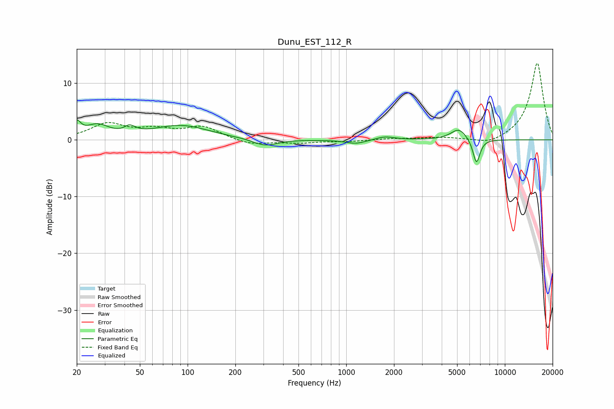

# Dunu_EST_112_R
See [usage instructions](https://github.com/jaakkopasanen/AutoEq#usage) for more options and info.

### Parametric EQs
Apply preamp of -3.6 dB when using parametric equalizer.

|   # | Type    |   Fc (Hz) |    Q |   Gain (dB) |
|-----|---------|-----------|------|-------------|
|   1 | Peaking |        20 | 5.81 |         2.3 |
|   2 | Peaking |        27 | 1.93 |         2.3 |
|   3 | Peaking |        44 | 5.03 |         2.7 |
|   4 | Peaking |        44 | 6    |        -1.5 |
|   5 | Peaking |        91 | 0.79 |         2.5 |
|   6 | Peaking |       308 | 1.84 |        -1.2 |
|   7 | Peaking |      1153 | 2.17 |        -0.7 |
|   8 | Peaking |      1750 | 2.37 |         0.6 |
|   9 | Peaking |      5130 | 2.76 |         2   |
|  10 | Peaking |      6622 | 6    |        -4.4 |

### Fixed Band EQs
When using fixed band (also called graphic) equalizer, apply preamp of **-13.6 dB** (if available) and set gains manually with these parameters.

|   # | Type    |   Fc (Hz) |    Q |   Gain (dB) |
|-----|---------|-----------|------|-------------|
|   1 | Peaking |        31 | 1.41 |         2.7 |
|   2 | Peaking |        62 | 1.41 |         1.5 |
|   3 | Peaking |       125 | 1.41 |         2.2 |
|   4 | Peaking |       250 | 1.41 |        -0.9 |
|   5 | Peaking |       500 | 1.41 |        -0.5 |
|   6 | Peaking |      1000 | 1.41 |        -0.3 |
|   7 | Peaking |      2000 | 1.41 |         0.2 |
|   8 | Peaking |      4000 | 1.41 |         0.4 |
|   9 | Peaking |      8000 | 1.41 |        -1   |
|  10 | Peaking |     16000 | 1.41 |        13.7 |

### Graphs

