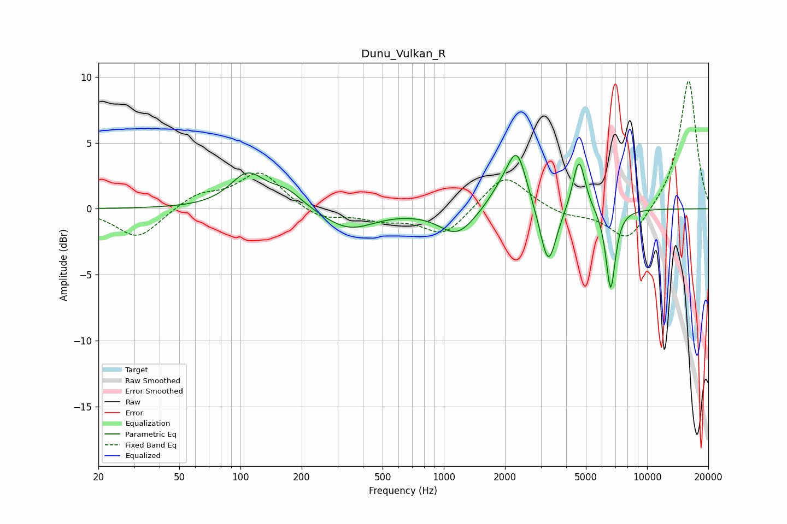

# Dunu_Vulkan_R
See [usage instructions](https://github.com/jaakkopasanen/AutoEq#usage) for more options and info.

### Parametric EQs
Apply preamp of -4.1 dB when using parametric equalizer.

|   # | Type    |   Fc (Hz) |    Q |   Gain (dB) |
|-----|---------|-----------|------|-------------|
|   1 | Peaking |       108 | 1.65 |         2.5 |
|   2 | Peaking |       169 | 1.74 |         1.2 |
|   3 | Peaking |       341 | 1.12 |        -1.6 |
|   4 | Peaking |      1156 | 1.67 |        -1.6 |
|   5 | Peaking |      1220 | 1.33 |        -0.4 |
|   6 | Peaking |      1936 | 1.94 |         1.3 |
|   7 | Peaking |      2294 | 2.93 |         4   |
|   8 | Peaking |      3265 | 3.53 |        -4.7 |
|   9 | Peaking |      4623 | 4.56 |         4.1 |
|  10 | Peaking |      6618 | 5.82 |        -6.2 |

### Fixed Band EQs
When using fixed band (also called graphic) equalizer, apply preamp of **-9.8 dB** (if available) and set gains manually with these parameters.

|   # | Type    |   Fc (Hz) |    Q |   Gain (dB) |
|-----|---------|-----------|------|-------------|
|   1 | Peaking |        31 | 1.41 |        -2.3 |
|   2 | Peaking |        62 | 1.41 |         1.1 |
|   3 | Peaking |       125 | 1.41 |         2.8 |
|   4 | Peaking |       250 | 1.41 |        -0.9 |
|   5 | Peaking |       500 | 1.41 |        -0.7 |
|   6 | Peaking |      1000 | 1.41 |        -2.1 |
|   7 | Peaking |      2000 | 1.41 |         2.7 |
|   8 | Peaking |      4000 | 1.41 |        -0.5 |
|   9 | Peaking |      8000 | 1.41 |        -2.6 |
|  10 | Peaking |     16000 | 1.41 |         9.9 |

### Graphs

