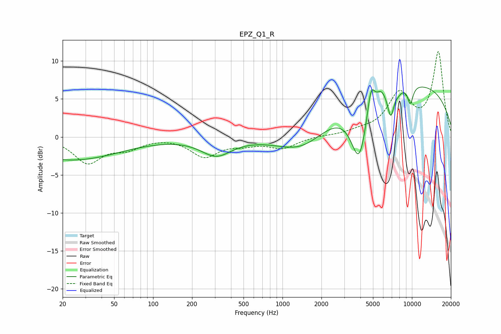

# EPZ_Q1_R
See [usage instructions](https://github.com/jaakkopasanen/AutoEq#usage) for more options and info.

### Parametric EQs
Apply preamp of -6.7 dB when using parametric equalizer.

|   # | Type    |   Fc (Hz) |    Q |   Gain (dB) |
|-----|---------|-----------|------|-------------|
|   1 | Peaking |        23 | 0.37 |        -3   |
|   2 | Peaking |       307 | 1.21 |        -2.3 |
|   3 | Peaking |      1444 | 0.72 |        -3.3 |
|   4 | Peaking |      3915 | 2.18 |        -8.1 |
|   5 | Peaking |      4825 | 4.79 |         3.8 |
|   6 | Peaking |      5772 | 4.21 |         1.1 |
|   7 | Peaking |      6862 | 5.39 |        -3.5 |
|   8 | Peaking |      7865 | 5.52 |        -0.4 |
|   9 | Peaking |      8606 | 0.2  |         7.2 |
|  10 | Peaking |      9716 | 5.8  |        -2.3 |

### Fixed Band EQs
When using fixed band (also called graphic) equalizer, apply preamp of **-11.3 dB** (if available) and set gains manually with these parameters.

|   # | Type    |   Fc (Hz) |    Q |   Gain (dB) |
|-----|---------|-----------|------|-------------|
|   1 | Peaking |        31 | 1.41 |        -3.3 |
|   2 | Peaking |        62 | 1.41 |        -1.3 |
|   3 | Peaking |       125 | 1.41 |         0.1 |
|   4 | Peaking |       250 | 1.41 |        -2.5 |
|   5 | Peaking |       500 | 1.41 |        -0.8 |
|   6 | Peaking |      1000 | 1.41 |        -1.4 |
|   7 | Peaking |      2000 | 1.41 |         0.1 |
|   8 | Peaking |      4000 | 1.41 |         0.5 |
|   9 | Peaking |      8000 | 1.41 |         5.4 |
|  10 | Peaking |     16000 | 1.41 |        11   |

### Graphs

