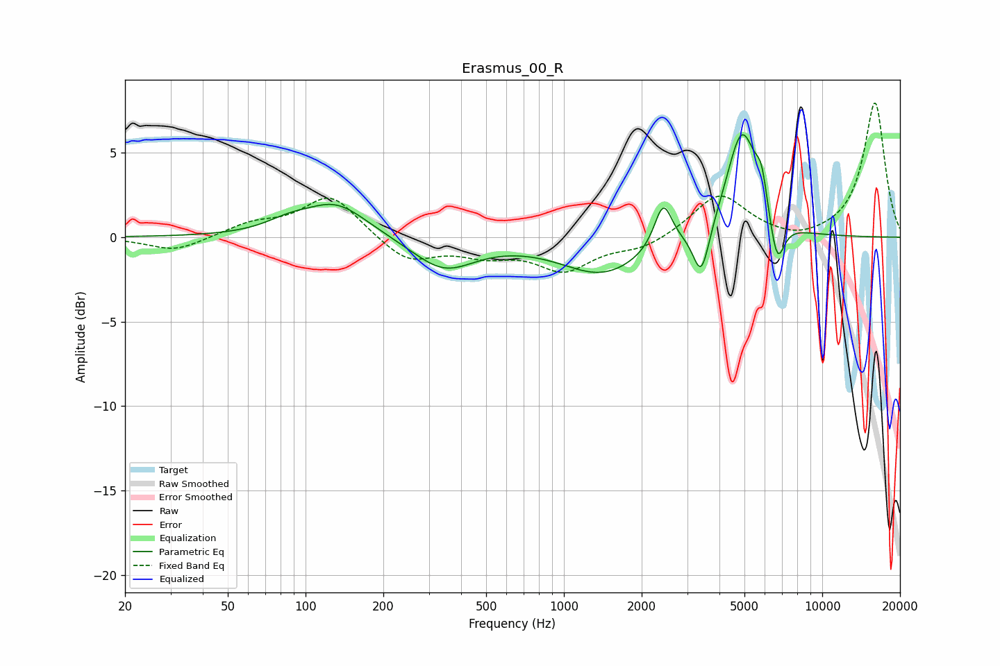

# Erasmus_00_R
See [usage instructions](https://github.com/jaakkopasanen/AutoEq#usage) for more options and info.

### Parametric EQs
Apply preamp of -6.2 dB when using parametric equalizer.

|   # | Type    |   Fc (Hz) |    Q |   Gain (dB) |
|-----|---------|-----------|------|-------------|
|   1 | Peaking |        85 | 1.62 |         0.5 |
|   2 | Peaking |       131 | 1.16 |         2   |
|   3 | Peaking |       343 | 1.18 |        -1.9 |
|   4 | Peaking |      1417 | 0.87 |        -2.2 |
|   5 | Peaking |      2424 | 4.1  |         2.7 |
|   6 | Peaking |      3404 | 4.45 |        -3   |
|   7 | Peaking |      4888 | 2.31 |         6.4 |
|   8 | Peaking |      5831 | 5.98 |         1.9 |
|   9 | Peaking |      6457 | 3.56 |        -0.7 |
|  10 | Peaking |      6709 | 5.07 |        -2.3 |

### Fixed Band EQs
When using fixed band (also called graphic) equalizer, apply preamp of **-8.0 dB** (if available) and set gains manually with these parameters.

|   # | Type    |   Fc (Hz) |    Q |   Gain (dB) |
|-----|---------|-----------|------|-------------|
|   1 | Peaking |        31 | 1.41 |        -0.8 |
|   2 | Peaking |        62 | 1.41 |         0.7 |
|   3 | Peaking |       125 | 1.41 |         2.5 |
|   4 | Peaking |       250 | 1.41 |        -1.5 |
|   5 | Peaking |       500 | 1.41 |        -0.9 |
|   6 | Peaking |      1000 | 1.41 |        -1.9 |
|   7 | Peaking |      2000 | 1.41 |        -0.7 |
|   8 | Peaking |      4000 | 1.41 |         2.6 |
|   9 | Peaking |      8000 | 1.41 |        -0.4 |
|  10 | Peaking |     16000 | 1.41 |         8   |

### Graphs

