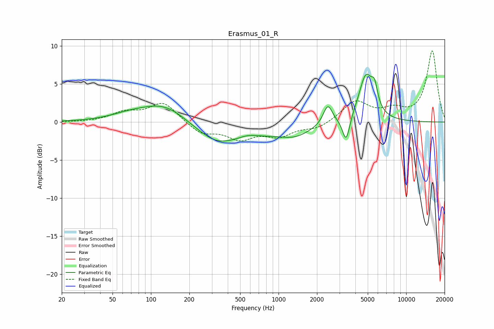

# Erasmus_01_R
See [usage instructions](https://github.com/jaakkopasanen/AutoEq#usage) for more options and info.

### Parametric EQs
Apply preamp of -6.4 dB when using parametric equalizer.

|   # | Type    |   Fc (Hz) |    Q |   Gain (dB) |
|-----|---------|-----------|------|-------------|
|   1 | Peaking |        67 | 1.01 |         0.6 |
|   2 | Peaking |       130 | 0.73 |         3   |
|   3 | Peaking |       320 | 1.35 |        -0.8 |
|   4 | Peaking |       368 | 0.44 |        -2.7 |
|   5 | Peaking |       575 | 1.77 |         0.6 |
|   6 | Peaking |      1356 | 1.12 |        -1.3 |
|   7 | Peaking |      2434 | 3.95 |         2.6 |
|   8 | Peaking |      3384 | 5.01 |        -3.3 |
|   9 | Peaking |      4842 | 2.49 |         6.1 |
|  10 | Peaking |      5653 | 6    |         2.3 |

### Fixed Band EQs
When using fixed band (also called graphic) equalizer, apply preamp of **-9.4 dB** (if available) and set gains manually with these parameters.

|   # | Type    |   Fc (Hz) |    Q |   Gain (dB) |
|-----|---------|-----------|------|-------------|
|   1 | Peaking |        31 | 1.41 |        -0   |
|   2 | Peaking |        62 | 1.41 |         1.2 |
|   3 | Peaking |       125 | 1.41 |         2.6 |
|   4 | Peaking |       250 | 1.41 |        -1.5 |
|   5 | Peaking |       500 | 1.41 |        -2   |
|   6 | Peaking |      1000 | 1.41 |        -1.6 |
|   7 | Peaking |      2000 | 1.41 |        -0.9 |
|   8 | Peaking |      4000 | 1.41 |         2.7 |
|   9 | Peaking |      8000 | 1.41 |         1.3 |
|  10 | Peaking |     16000 | 1.41 |         9.3 |

### Graphs

