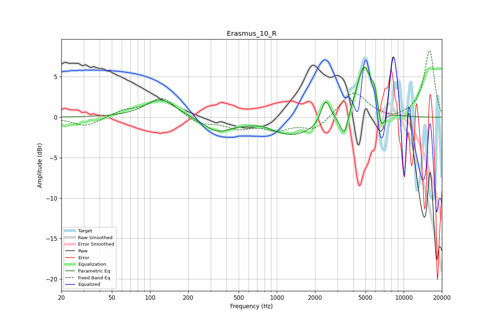

# Erasmus_10_R
See [usage instructions](https://github.com/jaakkopasanen/AutoEq#usage) for more options and info.

### Parametric EQs
Apply preamp of -6.3 dB when using parametric equalizer.

|   # | Type    |   Fc (Hz) |    Q |   Gain (dB) |
|-----|---------|-----------|------|-------------|
|   1 | Peaking |       121 | 1.21 |         2.3 |
|   2 | Peaking |       336 | 1.34 |        -1.6 |
|   3 | Peaking |       773 | 1.54 |         0.6 |
|   4 | Peaking |      1314 | 0.61 |        -2.4 |
|   5 | Peaking |      2425 | 3.87 |         3.1 |
|   6 | Peaking |      3403 | 4.59 |        -2.9 |
|   7 | Peaking |      4862 | 2.32 |         6.7 |
|   8 | Peaking |      5882 | 5.91 |         2   |
|   9 | Peaking |      6460 | 3.5  |        -0.7 |
|  10 | Peaking |      6692 | 5.29 |        -2.1 |

### Fixed Band EQs
When using fixed band (also called graphic) equalizer, apply preamp of **-8.3 dB** (if available) and set gains manually with these parameters.

|   # | Type    |   Fc (Hz) |    Q |   Gain (dB) |
|-----|---------|-----------|------|-------------|
|   1 | Peaking |        31 | 1.41 |        -1.2 |
|   2 | Peaking |        62 | 1.41 |         0.8 |
|   3 | Peaking |       125 | 1.41 |         2.4 |
|   4 | Peaking |       250 | 1.41 |        -0.9 |
|   5 | Peaking |       500 | 1.41 |        -1.2 |
|   6 | Peaking |      1000 | 1.41 |        -1.3 |
|   7 | Peaking |      2000 | 1.41 |        -1.6 |
|   8 | Peaking |      4000 | 1.41 |         3.3 |
|   9 | Peaking |      8000 | 1.41 |        -0.5 |
|  10 | Peaking |     16000 | 1.41 |         8.3 |

### Graphs

