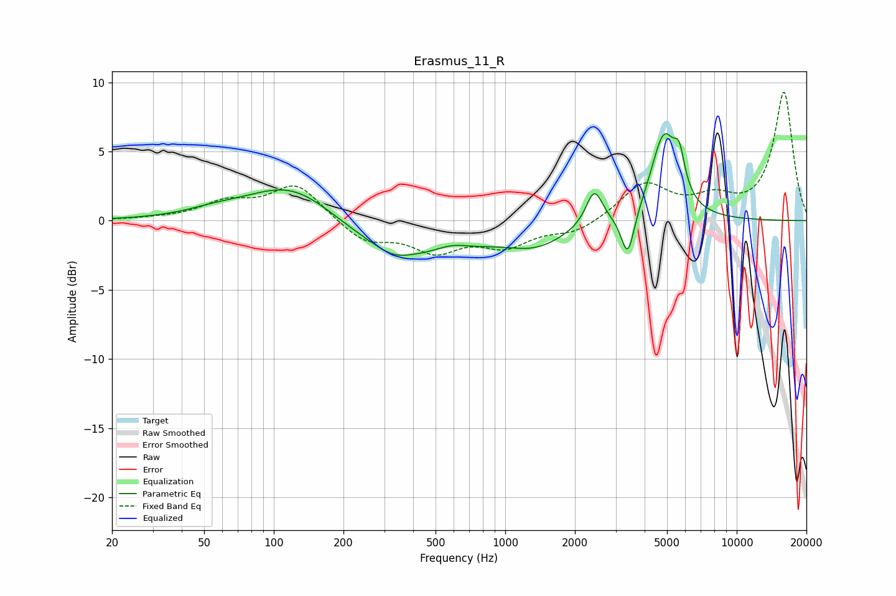

# Erasmus_11_R
See [usage instructions](https://github.com/jaakkopasanen/AutoEq#usage) for more options and info.

### Parametric EQs
Apply preamp of -6.4 dB when using parametric equalizer.

|   # | Type    |   Fc (Hz) |    Q |   Gain (dB) |
|-----|---------|-----------|------|-------------|
|   1 | Peaking |        55 | 1.2  |         0.4 |
|   2 | Peaking |       121 | 0.73 |         3.1 |
|   3 | Peaking |       327 | 1.85 |        -0.6 |
|   4 | Peaking |       376 | 0.45 |        -2.7 |
|   5 | Peaking |       587 | 1.95 |         0.5 |
|   6 | Peaking |      1375 | 1.13 |        -1.3 |
|   7 | Peaking |      2425 | 3.97 |         2.6 |
|   8 | Peaking |      3384 | 4.93 |        -3.4 |
|   9 | Peaking |      4845 | 2.5  |         6.1 |
|  10 | Peaking |      5651 | 6    |         2.4 |

### Fixed Band EQs
When using fixed band (also called graphic) equalizer, apply preamp of **-9.4 dB** (if available) and set gains manually with these parameters.

|   # | Type    |   Fc (Hz) |    Q |   Gain (dB) |
|-----|---------|-----------|------|-------------|
|   1 | Peaking |        31 | 1.41 |         0.1 |
|   2 | Peaking |        62 | 1.41 |         1.2 |
|   3 | Peaking |       125 | 1.41 |         2.6 |
|   4 | Peaking |       250 | 1.41 |        -1.5 |
|   5 | Peaking |       500 | 1.41 |        -2   |
|   6 | Peaking |      1000 | 1.41 |        -1.7 |
|   7 | Peaking |      2000 | 1.41 |        -0.9 |
|   8 | Peaking |      4000 | 1.41 |         2.6 |
|   9 | Peaking |      8000 | 1.41 |         1.4 |
|  10 | Peaking |     16000 | 1.41 |         9.3 |

### Graphs

