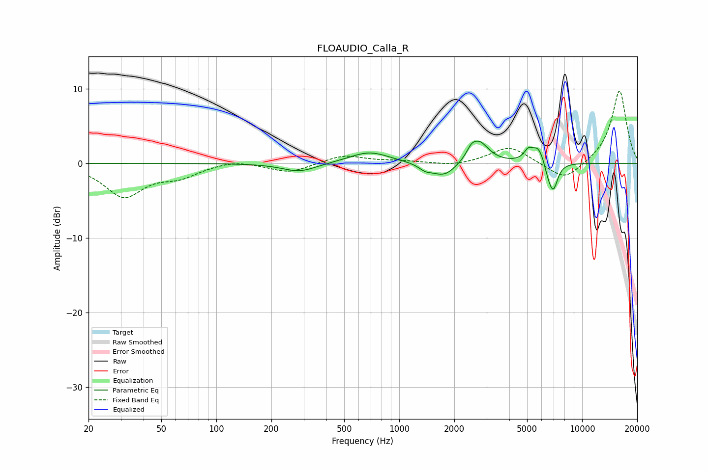

# FLOAUDIO_Calla_R
See [usage instructions](https://github.com/jaakkopasanen/AutoEq#usage) for more options and info.

### Parametric EQs
Apply preamp of -3.1 dB when using parametric equalizer.

|   # | Type    |   Fc (Hz) |    Q |   Gain (dB) |
|-----|---------|-----------|------|-------------|
|   1 | Peaking |       284 | 1.52 |        -1.2 |
|   2 | Peaking |       686 | 1.29 |         1.6 |
|   3 | Peaking |      1390 | 3.92 |        -0.7 |
|   4 | Peaking |      1761 | 2.11 |        -1.9 |
|   5 | Peaking |      2475 | 5.73 |         0.9 |
|   6 | Peaking |      2731 | 2.69 |         2.9 |
|   7 | Peaking |      5072 | 6    |         1.2 |
|   8 | Peaking |      5772 | 3.86 |         2.3 |
|   9 | Peaking |      6528 | 6    |        -1.4 |
|  10 | Peaking |      6963 | 5.55 |        -3.4 |

### Fixed Band EQs
When using fixed band (also called graphic) equalizer, apply preamp of **-9.8 dB** (if available) and set gains manually with these parameters.

|   # | Type    |   Fc (Hz) |    Q |   Gain (dB) |
|-----|---------|-----------|------|-------------|
|   1 | Peaking |        31 | 1.41 |        -4.3 |
|   2 | Peaking |        62 | 1.41 |        -1.5 |
|   3 | Peaking |       125 | 1.41 |         0.5 |
|   4 | Peaking |       250 | 1.41 |        -1.3 |
|   5 | Peaking |       500 | 1.41 |         1.1 |
|   6 | Peaking |      1000 | 1.41 |         0.3 |
|   7 | Peaking |      2000 | 1.41 |        -0.4 |
|   8 | Peaking |      4000 | 1.41 |         2.3 |
|   9 | Peaking |      8000 | 1.41 |        -2.5 |
|  10 | Peaking |     16000 | 1.41 |         9.9 |

### Graphs

