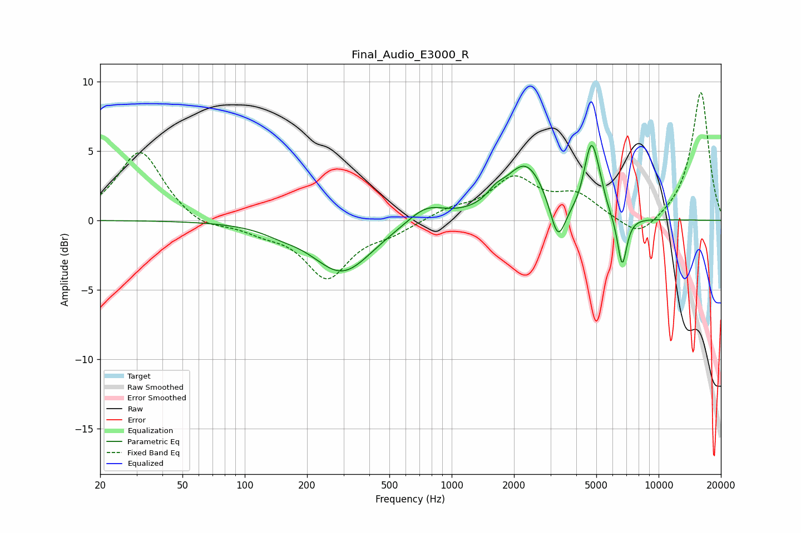

# Final_Audio_E3000_R
See [usage instructions](https://github.com/jaakkopasanen/AutoEq#usage) for more options and info.

### Parametric EQs
Apply preamp of -5.5 dB when using parametric equalizer.

|   # | Type    |   Fc (Hz) |    Q |   Gain (dB) |
|-----|---------|-----------|------|-------------|
|   1 | Peaking |       148 | 1.68 |        -0.3 |
|   2 | Peaking |       296 | 0.98 |        -3.7 |
|   3 | Peaking |       752 | 1.55 |         1.2 |
|   4 | Peaking |      1635 | 3.43 |         0.6 |
|   5 | Peaking |      2284 | 1.42 |         4   |
|   6 | Peaking |      3258 | 3.75 |        -3.1 |
|   7 | Peaking |      4458 | 5.74 |         0.8 |
|   8 | Peaking |      4747 | 4.67 |         4.2 |
|   9 | Peaking |      5164 | 5.1  |         1.2 |
|  10 | Peaking |      6665 | 6    |        -3.7 |

### Fixed Band EQs
When using fixed band (also called graphic) equalizer, apply preamp of **-9.3 dB** (if available) and set gains manually with these parameters.

|   # | Type    |   Fc (Hz) |    Q |   Gain (dB) |
|-----|---------|-----------|------|-------------|
|   1 | Peaking |        31 | 1.41 |         5.1 |
|   2 | Peaking |        62 | 1.41 |        -0.7 |
|   3 | Peaking |       125 | 1.41 |        -0.7 |
|   4 | Peaking |       250 | 1.41 |        -4   |
|   5 | Peaking |       500 | 1.41 |        -0.8 |
|   6 | Peaking |      1000 | 1.41 |         0.7 |
|   7 | Peaking |      2000 | 1.41 |         2.9 |
|   8 | Peaking |      4000 | 1.41 |         1.7 |
|   9 | Peaking |      8000 | 1.41 |        -1.5 |
|  10 | Peaking |     16000 | 1.41 |         9.3 |

### Graphs

