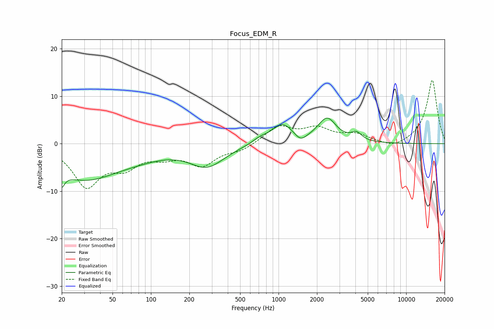

# Focus_EDM_R
See [usage instructions](https://github.com/jaakkopasanen/AutoEq#usage) for more options and info.

### Parametric EQs
Apply preamp of -5.5 dB when using parametric equalizer.

|   # | Type    |   Fc (Hz) |    Q |   Gain (dB) |
|-----|---------|-----------|------|-------------|
|   1 | Peaking |        20 | 5.97 |        -8.2 |
|   2 | Peaking |        20 | 6    |         5   |
|   3 | Peaking |        30 | 0.54 |        -7   |
|   4 | Peaking |        79 | 0.62 |        -1.5 |
|   5 | Peaking |       275 | 1.04 |        -4.5 |
|   6 | Peaking |       715 | 2.29 |         0.9 |
|   7 | Peaking |      1074 | 1.67 |         4   |
|   8 | Peaking |      1487 | 3.16 |        -1.6 |
|   9 | Peaking |      2400 | 1.96 |         5.1 |
|  10 | Peaking |      4078 | 3.42 |         1.7 |

### Fixed Band EQs
When using fixed band (also called graphic) equalizer, apply preamp of **-13.4 dB** (if available) and set gains manually with these parameters.

|   # | Type    |   Fc (Hz) |    Q |   Gain (dB) |
|-----|---------|-----------|------|-------------|
|   1 | Peaking |        31 | 1.41 |        -8.6 |
|   2 | Peaking |        62 | 1.41 |        -4   |
|   3 | Peaking |       125 | 1.41 |        -2   |
|   4 | Peaking |       250 | 1.41 |        -4.2 |
|   5 | Peaking |       500 | 1.41 |        -1.3 |
|   6 | Peaking |      1000 | 1.41 |         3.6 |
|   7 | Peaking |      2000 | 1.41 |         2.9 |
|   8 | Peaking |      4000 | 1.41 |         1.7 |
|   9 | Peaking |      8000 | 1.41 |        -1.2 |
|  10 | Peaking |     16000 | 1.41 |        13.5 |

### Graphs

