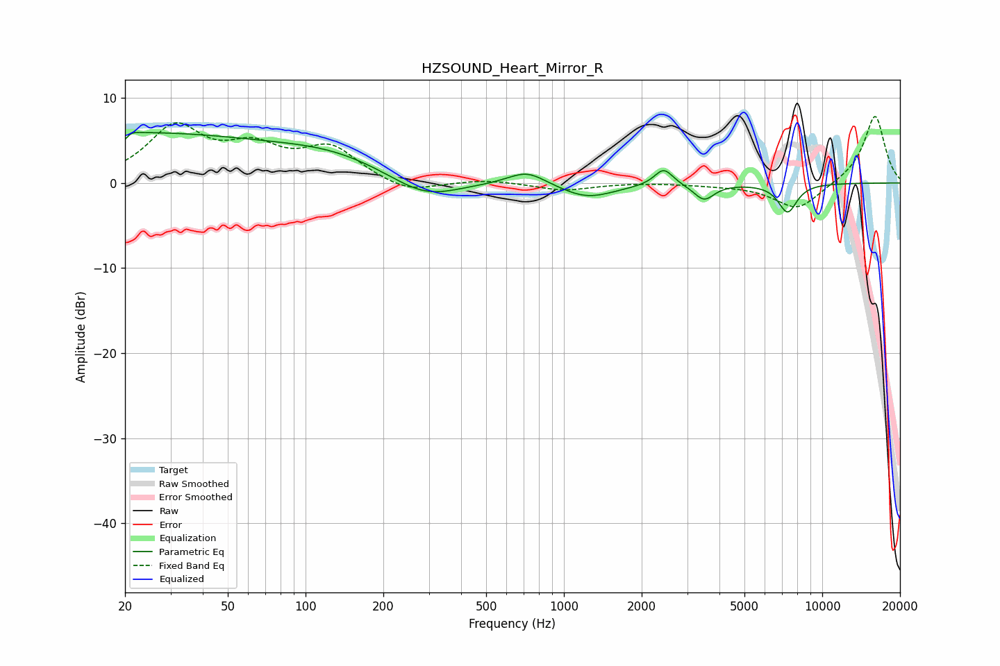

# HZSOUND_Heart_Mirror_R
See [usage instructions](https://github.com/jaakkopasanen/AutoEq#usage) for more options and info.

### Parametric EQs
Apply preamp of -6.0 dB when using parametric equalizer.

|   # | Type    |   Fc (Hz) |    Q |   Gain (dB) |
|-----|---------|-----------|------|-------------|
|   1 | Peaking |        20 | 0.21 |         5.8 |
|   2 | Peaking |        20 | 5.84 |        -4.2 |
|   3 | Peaking |        20 | 5.51 |         3.5 |
|   4 | Peaking |       130 | 0.65 |         2   |
|   5 | Peaking |       290 | 1.07 |        -2.4 |
|   6 | Peaking |       719 | 1.9  |         1.7 |
|   7 | Peaking |      1232 | 1.33 |        -1.8 |
|   8 | Peaking |      2434 | 3.95 |         2   |
|   9 | Peaking |      3487 | 3.6  |        -1.9 |
|  10 | Peaking |      7345 | 3.71 |        -3.4 |

### Fixed Band EQs
When using fixed band (also called graphic) equalizer, apply preamp of **-7.9 dB** (if available) and set gains manually with these parameters.

|   # | Type    |   Fc (Hz) |    Q |   Gain (dB) |
|-----|---------|-----------|------|-------------|
|   1 | Peaking |        31 | 1.41 |         6.3 |
|   2 | Peaking |        62 | 1.41 |         3.4 |
|   3 | Peaking |       125 | 1.41 |         3.9 |
|   4 | Peaking |       250 | 1.41 |        -1.4 |
|   5 | Peaking |       500 | 1.41 |         0.4 |
|   6 | Peaking |      1000 | 1.41 |        -0.9 |
|   7 | Peaking |      2000 | 1.41 |         0.1 |
|   8 | Peaking |      4000 | 1.41 |        -0.2 |
|   9 | Peaking |      8000 | 1.41 |        -3.2 |
|  10 | Peaking |     16000 | 1.41 |         8   |

### Graphs

