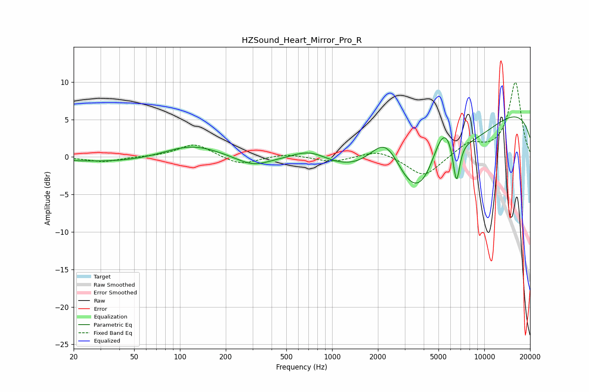

# HZSound_Heart_Mirror_Pro_R
See [usage instructions](https://github.com/jaakkopasanen/AutoEq#usage) for more options and info.

### Parametric EQs
Apply preamp of -5.4 dB when using parametric equalizer.

|   # | Type    |   Fc (Hz) |    Q |   Gain (dB) |
|-----|---------|-----------|------|-------------|
|   1 | Peaking |        53 | 0.31 |        -0.9 |
|   2 | Peaking |       118 | 0.73 |         2.1 |
|   3 | Peaking |       301 | 1.28 |        -1.3 |
|   4 | Peaking |       717 | 1.13 |         1.8 |
|   5 | Peaking |      1199 | 3.65 |         0   |
|   6 | Peaking |      2275 | 1.14 |         7.6 |
|   7 | Peaking |      3740 | 0.49 |       -15.7 |
|   8 | Peaking |      5379 | 1.49 |         8   |
|   9 | Peaking |      6559 | 5.85 |        -6   |
|  10 | Peaking |     10000 | 0.18 |         7.7 |

### Fixed Band EQs
When using fixed band (also called graphic) equalizer, apply preamp of **-10.0 dB** (if available) and set gains manually with these parameters.

|   # | Type    |   Fc (Hz) |    Q |   Gain (dB) |
|-----|---------|-----------|------|-------------|
|   1 | Peaking |        31 | 1.41 |        -0.7 |
|   2 | Peaking |        62 | 1.41 |         0   |
|   3 | Peaking |       125 | 1.41 |         1.8 |
|   4 | Peaking |       250 | 1.41 |        -1.1 |
|   5 | Peaking |       500 | 1.41 |         0.5 |
|   6 | Peaking |      1000 | 1.41 |        -0.7 |
|   7 | Peaking |      2000 | 1.41 |         1   |
|   8 | Peaking |      4000 | 1.41 |        -2.8 |
|   9 | Peaking |      8000 | 1.41 |         1.8 |
|  10 | Peaking |     16000 | 1.41 |         9.9 |

### Graphs

