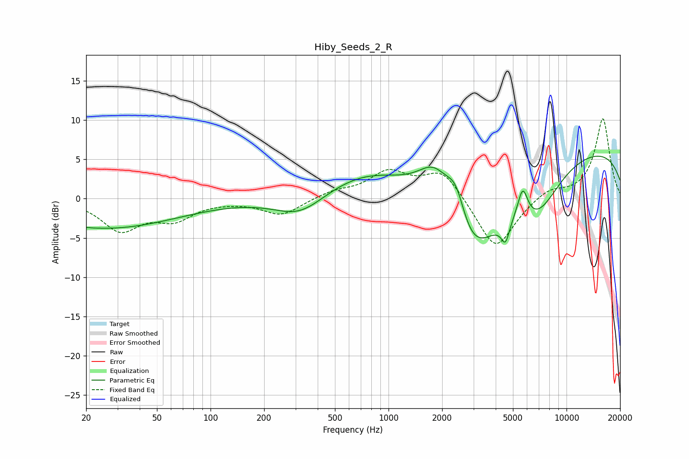

# Hiby_Seeds_2_R
See [usage instructions](https://github.com/jaakkopasanen/AutoEq#usage) for more options and info.

### Parametric EQs
Apply preamp of -5.5 dB when using parametric equalizer.

|   # | Type    |   Fc (Hz) |    Q |   Gain (dB) |
|-----|---------|-----------|------|-------------|
|   1 | Peaking |        25 | 0.34 |        -3.8 |
|   2 | Peaking |       319 | 0.97 |        -3   |
|   3 | Peaking |       847 | 0.49 |         4.3 |
|   4 | Peaking |      1823 | 1.35 |         6.3 |
|   5 | Peaking |      2401 | 2.4  |         5.7 |
|   6 | Peaking |      2800 | 0.73 |       -14.2 |
|   7 | Peaking |      4537 | 6    |        -2.7 |
|   8 | Peaking |      5677 | 4.81 |         4   |
|   9 | Peaking |      6857 | 1.07 |        -4.9 |
|  10 | Peaking |     10000 | 0.18 |         6.8 |

### Fixed Band EQs
When using fixed band (also called graphic) equalizer, apply preamp of **-10.2 dB** (if available) and set gains manually with these parameters.

|   # | Type    |   Fc (Hz) |    Q |   Gain (dB) |
|-----|---------|-----------|------|-------------|
|   1 | Peaking |        31 | 1.41 |        -3.9 |
|   2 | Peaking |        62 | 1.41 |        -2.4 |
|   3 | Peaking |       125 | 1.41 |        -0.1 |
|   4 | Peaking |       250 | 1.41 |        -2.1 |
|   5 | Peaking |       500 | 1.41 |         0.8 |
|   6 | Peaking |      1000 | 1.41 |         3.2 |
|   7 | Peaking |      2000 | 1.41 |         3.6 |
|   8 | Peaking |      4000 | 1.41 |        -6.7 |
|   9 | Peaking |      8000 | 1.41 |         1.3 |
|  10 | Peaking |     16000 | 1.41 |        10.2 |

### Graphs

