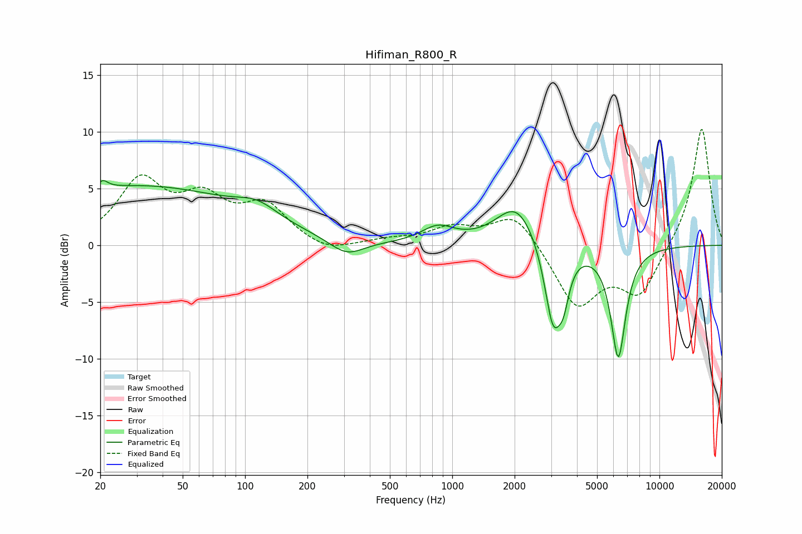

# Hifiman_R800_R
See [usage instructions](https://github.com/jaakkopasanen/AutoEq#usage) for more options and info.

### Parametric EQs
Apply preamp of -5.8 dB when using parametric equalizer.

|   # | Type    |   Fc (Hz) |    Q |   Gain (dB) |
|-----|---------|-----------|------|-------------|
|   1 | Peaking |        20 | 5.95 |        -2.6 |
|   2 | Peaking |        20 | 5.87 |         3.3 |
|   3 | Peaking |        30 | 0.27 |         5.2 |
|   4 | Peaking |       115 | 1.4  |         1.3 |
|   5 | Peaking |       309 | 1.7  |        -1.4 |
|   6 | Peaking |       851 | 1.79 |         1.4 |
|   7 | Peaking |      2047 | 1.45 |         3.7 |
|   8 | Peaking |      3062 | 3.4  |        -7.2 |
|   9 | Peaking |      3439 | 5.05 |        -2.8 |
|  10 | Peaking |      6331 | 3.76 |        -9.8 |

### Fixed Band EQs
When using fixed band (also called graphic) equalizer, apply preamp of **-10.3 dB** (if available) and set gains manually with these parameters.

|   # | Type    |   Fc (Hz) |    Q |   Gain (dB) |
|-----|---------|-----------|------|-------------|
|   1 | Peaking |        31 | 1.41 |         5.4 |
|   2 | Peaking |        62 | 1.41 |         3.5 |
|   3 | Peaking |       125 | 1.41 |         3.3 |
|   4 | Peaking |       250 | 1.41 |        -0.8 |
|   5 | Peaking |       500 | 1.41 |         0.4 |
|   6 | Peaking |      1000 | 1.41 |         1.4 |
|   7 | Peaking |      2000 | 1.41 |         2.9 |
|   8 | Peaking |      4000 | 1.41 |        -5.4 |
|   9 | Peaking |      8000 | 1.41 |        -4.3 |
|  10 | Peaking |     16000 | 1.41 |        10.6 |

### Graphs

