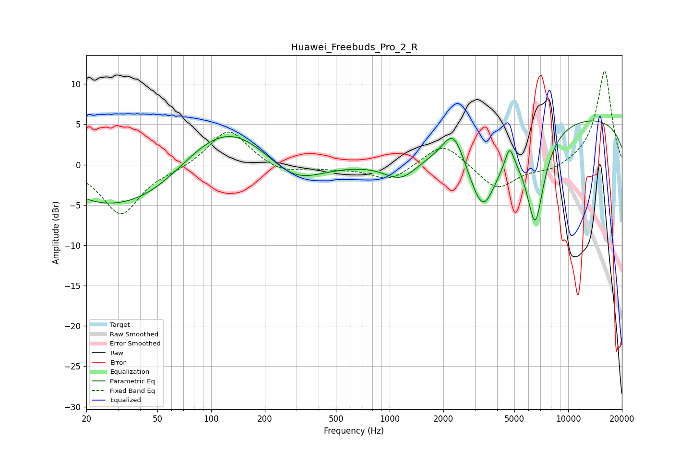

# Huawei_Freebuds_Pro_2_R
See [usage instructions](https://github.com/jaakkopasanen/AutoEq#usage) for more options and info.

### Parametric EQs
Apply preamp of -5.5 dB when using parametric equalizer.

|   # | Type    |   Fc (Hz) |    Q |   Gain (dB) |
|-----|---------|-----------|------|-------------|
|   1 | Peaking |        22 | 0.8  |        -1.7 |
|   2 | Peaking |        44 | 0.47 |        -5.6 |
|   3 | Peaking |       116 | 0.52 |         7   |
|   4 | Peaking |       289 | 0.85 |        -3.8 |
|   5 | Peaking |      1156 | 1.5  |        -2.5 |
|   6 | Peaking |      2278 | 2.42 |         4   |
|   7 | Peaking |      3325 | 1.67 |        -9.1 |
|   8 | Peaking |      4695 | 5.82 |         2.6 |
|   9 | Peaking |      6535 | 2.62 |       -11.7 |
|  10 | Peaking |     10000 | 0.18 |         6.1 |

### Fixed Band EQs
When using fixed band (also called graphic) equalizer, apply preamp of **-11.7 dB** (if available) and set gains manually with these parameters.

|   # | Type    |   Fc (Hz) |    Q |   Gain (dB) |
|-----|---------|-----------|------|-------------|
|   1 | Peaking |        31 | 1.41 |        -6.1 |
|   2 | Peaking |        62 | 1.41 |        -0.5 |
|   3 | Peaking |       125 | 1.41 |         4.6 |
|   4 | Peaking |       250 | 1.41 |        -1.1 |
|   5 | Peaking |       500 | 1.41 |        -0.4 |
|   6 | Peaking |      1000 | 1.41 |        -2   |
|   7 | Peaking |      2000 | 1.41 |         2.9 |
|   8 | Peaking |      4000 | 1.41 |        -3.2 |
|   9 | Peaking |      8000 | 1.41 |        -0.8 |
|  10 | Peaking |     16000 | 1.41 |        11.7 |

### Graphs

