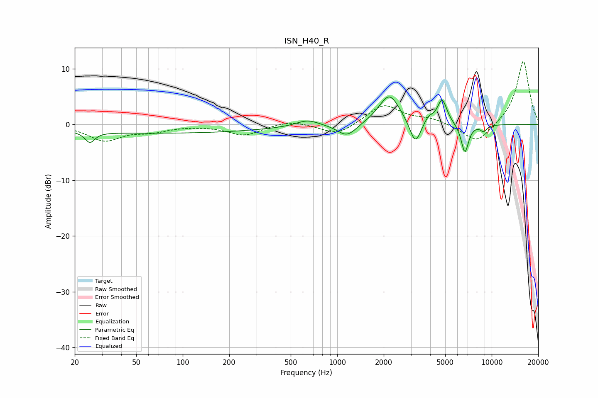

# ISN_H40_R
See [usage instructions](https://github.com/jaakkopasanen/AutoEq#usage) for more options and info.

### Parametric EQs
Apply preamp of -5.0 dB when using parametric equalizer.

|   # | Type    |   Fc (Hz) |    Q |   Gain (dB) |
|-----|---------|-----------|------|-------------|
|   1 | Peaking |        25 | 4.56 |        -1.9 |
|   2 | Peaking |        70 | 0.18 |        -1.5 |
|   3 | Peaking |       642 | 1.92 |         1.2 |
|   4 | Peaking |      1158 | 2.29 |        -2.3 |
|   5 | Peaking |      2175 | 2.07 |         5.5 |
|   6 | Peaking |      3203 | 3.89 |        -4.5 |
|   7 | Peaking |      3900 | 4.77 |         1.2 |
|   8 | Peaking |      4779 | 4.45 |         4.4 |
|   9 | Peaking |      6706 | 5.64 |        -5.2 |
|  10 | Peaking |      8867 | 5.99 |        -1.1 |

### Fixed Band EQs
When using fixed band (also called graphic) equalizer, apply preamp of **-11.4 dB** (if available) and set gains manually with these parameters.

|   # | Type    |   Fc (Hz) |    Q |   Gain (dB) |
|-----|---------|-----------|------|-------------|
|   1 | Peaking |        31 | 1.41 |        -2.8 |
|   2 | Peaking |        62 | 1.41 |        -1.1 |
|   3 | Peaking |       125 | 1.41 |        -0.1 |
|   4 | Peaking |       250 | 1.41 |        -1.9 |
|   5 | Peaking |       500 | 1.41 |         0.8 |
|   6 | Peaking |      1000 | 1.41 |        -2   |
|   7 | Peaking |      2000 | 1.41 |         3.6 |
|   8 | Peaking |      4000 | 1.41 |         0.9 |
|   9 | Peaking |      8000 | 1.41 |        -3.5 |
|  10 | Peaking |     16000 | 1.41 |        11.5 |

### Graphs

