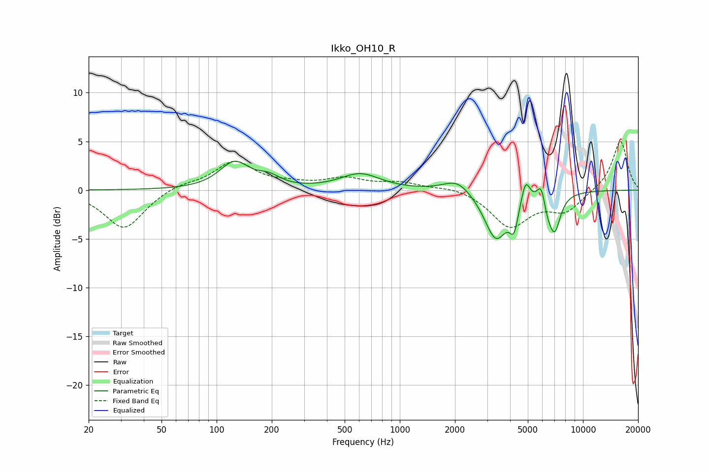

# Ikko_OH10_R
See [usage instructions](https://github.com/jaakkopasanen/AutoEq#usage) for more options and info.

### Parametric EQs
Apply preamp of -3.1 dB when using parametric equalizer.

|   # | Type    |   Fc (Hz) |    Q |   Gain (dB) |
|-----|---------|-----------|------|-------------|
|   1 | Peaking |       125 | 1.73 |         2.7 |
|   2 | Peaking |       193 | 2.29 |         0.9 |
|   3 | Peaking |       608 | 1.31 |         1.6 |
|   4 | Peaking |      2060 | 1.91 |         1.4 |
|   5 | Peaking |      3351 | 2.22 |        -5   |
|   6 | Peaking |      4203 | 5.99 |        -2.6 |
|   7 | Peaking |      4860 | 5.96 |         2.4 |
|   8 | Peaking |      5933 | 5.94 |         2.5 |
|   9 | Peaking |      6361 | 3.89 |        -2   |
|  10 | Peaking |      7030 | 4.38 |        -3.4 |

### Fixed Band EQs
When using fixed band (also called graphic) equalizer, apply preamp of **-5.1 dB** (if available) and set gains manually with these parameters.

|   # | Type    |   Fc (Hz) |    Q |   Gain (dB) |
|-----|---------|-----------|------|-------------|
|   1 | Peaking |        31 | 1.41 |        -4   |
|   2 | Peaking |        62 | 1.41 |         0.6 |
|   3 | Peaking |       125 | 1.41 |         2.9 |
|   4 | Peaking |       250 | 1.41 |         0.5 |
|   5 | Peaking |       500 | 1.41 |         1.1 |
|   6 | Peaking |      1000 | 1.41 |         0.7 |
|   7 | Peaking |      2000 | 1.41 |         0.4 |
|   8 | Peaking |      4000 | 1.41 |        -3.7 |
|   9 | Peaking |      8000 | 1.41 |        -2.1 |
|  10 | Peaking |     16000 | 1.41 |         5.1 |

### Graphs

