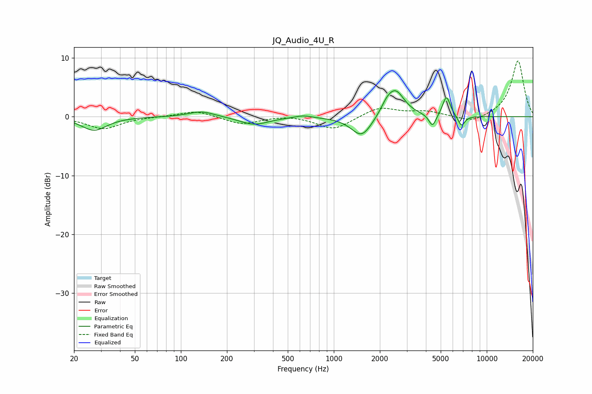

# JQ_Audio_4U_R
See [usage instructions](https://github.com/jaakkopasanen/AutoEq#usage) for more options and info.

### Parametric EQs
Apply preamp of -4.5 dB when using parametric equalizer.

|   # | Type    |   Fc (Hz) |    Q |   Gain (dB) |
|-----|---------|-----------|------|-------------|
|   1 | Peaking |        27 | 1.74 |        -2.3 |
|   2 | Peaking |       137 | 1.68 |         1   |
|   3 | Peaking |       301 | 1.51 |        -1.4 |
|   4 | Peaking |       630 | 2.67 |         0.4 |
|   5 | Peaking |      1523 | 2.08 |        -3.6 |
|   6 | Peaking |      2210 | 3.8  |         1.1 |
|   7 | Peaking |      2528 | 2.36 |         4.5 |
|   8 | Peaking |      4417 | 6    |        -2.2 |
|   9 | Peaking |      5449 | 5.56 |         3.5 |
|  10 | Peaking |      6831 | 6    |        -1.8 |

### Fixed Band EQs
When using fixed band (also called graphic) equalizer, apply preamp of **-9.6 dB** (if available) and set gains manually with these parameters.

|   # | Type    |   Fc (Hz) |    Q |   Gain (dB) |
|-----|---------|-----------|------|-------------|
|   1 | Peaking |        31 | 1.41 |        -2.1 |
|   2 | Peaking |        62 | 1.41 |         0   |
|   3 | Peaking |       125 | 1.41 |         1.1 |
|   4 | Peaking |       250 | 1.41 |        -1.3 |
|   5 | Peaking |       500 | 1.41 |         0.3 |
|   6 | Peaking |      1000 | 1.41 |        -2.2 |
|   7 | Peaking |      2000 | 1.41 |         1.7 |
|   8 | Peaking |      4000 | 1.41 |         0.8 |
|   9 | Peaking |      8000 | 1.41 |        -1.1 |
|  10 | Peaking |     16000 | 1.41 |         9.6 |

### Graphs

