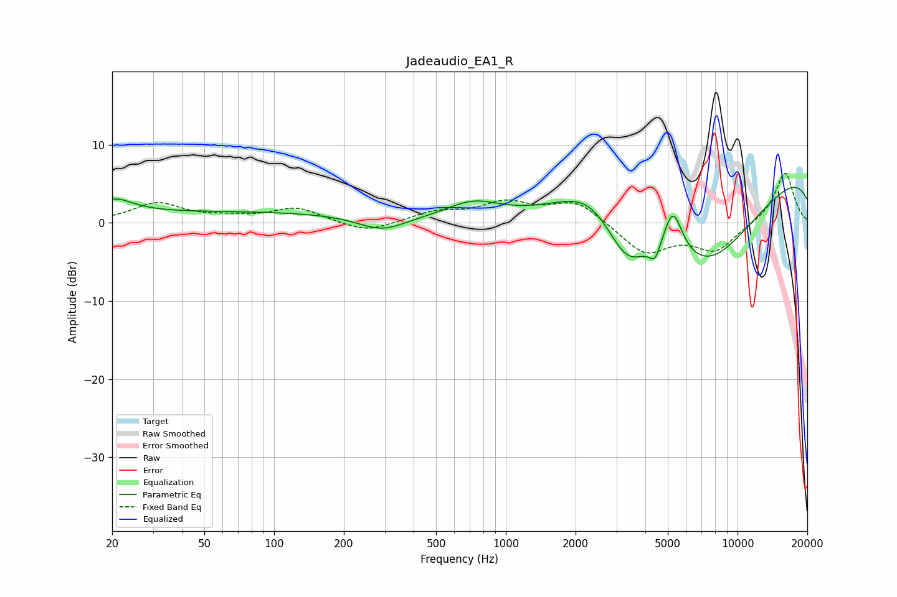

# Jadeaudio_EA1_R
See [usage instructions](https://github.com/jaakkopasanen/AutoEq#usage) for more options and info.

### Parametric EQs
Apply preamp of -4.7 dB when using parametric equalizer.

|   # | Type    |   Fc (Hz) |    Q |   Gain (dB) |
|-----|---------|-----------|------|-------------|
|   1 | Peaking |        20 | 1.74 |         2   |
|   2 | Peaking |        67 | 0.19 |         1.4 |
|   3 | Peaking |       292 | 1.35 |        -1.9 |
|   4 | Peaking |       722 | 1.24 |         2.1 |
|   5 | Peaking |      2306 | 1.03 |         4.1 |
|   6 | Peaking |      3323 | 1.49 |        -6   |
|   7 | Peaking |      4409 | 5.79 |        -2.3 |
|   8 | Peaking |      5261 | 3.35 |         5.8 |
|   9 | Peaking |      7236 | 0.45 |       -14.8 |
|  10 | Peaking |     10000 | 0.18 |        10.4 |

### Fixed Band EQs
When using fixed band (also called graphic) equalizer, apply preamp of **-6.4 dB** (if available) and set gains manually with these parameters.

|   # | Type    |   Fc (Hz) |    Q |   Gain (dB) |
|-----|---------|-----------|------|-------------|
|   1 | Peaking |        31 | 1.41 |         2.4 |
|   2 | Peaking |        62 | 1.41 |         0.5 |
|   3 | Peaking |       125 | 1.41 |         1.9 |
|   4 | Peaking |       250 | 1.41 |        -1.4 |
|   5 | Peaking |       500 | 1.41 |         1.3 |
|   6 | Peaking |      1000 | 1.41 |         2.4 |
|   7 | Peaking |      2000 | 1.41 |         2.8 |
|   8 | Peaking |      4000 | 1.41 |        -3.9 |
|   9 | Peaking |      8000 | 1.41 |        -3.5 |
|  10 | Peaking |     16000 | 1.41 |         6.6 |

### Graphs

