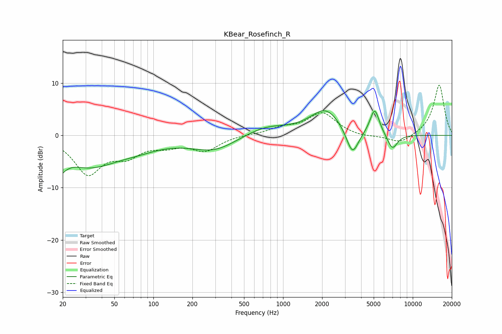

# KBear_Rosefinch_R
See [usage instructions](https://github.com/jaakkopasanen/AutoEq#usage) for more options and info.

### Parametric EQs
Apply preamp of -4.8 dB when using parametric equalizer.

|   # | Type    |   Fc (Hz) |    Q |   Gain (dB) |
|-----|---------|-----------|------|-------------|
|   1 | Peaking |        20 | 4.57 |        -5.9 |
|   2 | Peaking |        20 | 5.88 |         2.9 |
|   3 | Peaking |        31 | 0.64 |        -5.4 |
|   4 | Peaking |        75 | 0.7  |        -1.6 |
|   5 | Peaking |       293 | 0.8  |        -2.8 |
|   6 | Peaking |       734 | 0.84 |         1.8 |
|   7 | Peaking |      2134 | 1.18 |         4.9 |
|   8 | Peaking |      3426 | 2.95 |        -5.2 |
|   9 | Peaking |      5085 | 3.82 |         5   |
|  10 | Peaking |      6961 | 3.4  |        -3   |

### Fixed Band EQs
When using fixed band (also called graphic) equalizer, apply preamp of **-9.7 dB** (if available) and set gains manually with these parameters.

|   # | Type    |   Fc (Hz) |    Q |   Gain (dB) |
|-----|---------|-----------|------|-------------|
|   1 | Peaking |        31 | 1.41 |        -7   |
|   2 | Peaking |        62 | 1.41 |        -3.2 |
|   3 | Peaking |       125 | 1.41 |        -1.5 |
|   4 | Peaking |       250 | 1.41 |        -2.7 |
|   5 | Peaking |       500 | 1.41 |         0.1 |
|   6 | Peaking |      1000 | 1.41 |         1.2 |
|   7 | Peaking |      2000 | 1.41 |         4.2 |
|   8 | Peaking |      4000 | 1.41 |        -0.4 |
|   9 | Peaking |      8000 | 1.41 |        -1.7 |
|  10 | Peaking |     16000 | 1.41 |         9.7 |

### Graphs

