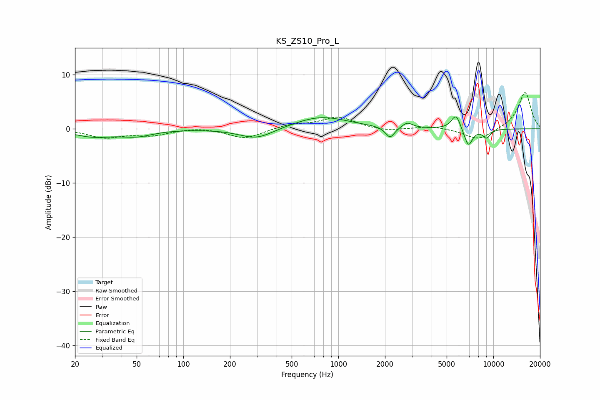

# KS_ZS10_Pro_L
See [usage instructions](https://github.com/jaakkopasanen/AutoEq#usage) for more options and info.

### Parametric EQs
Apply preamp of -2.3 dB when using parametric equalizer.

|   # | Type    |   Fc (Hz) |    Q |   Gain (dB) |
|-----|---------|-----------|------|-------------|
|   1 | Peaking |        26 | 1.14 |        -1.3 |
|   2 | Peaking |        50 | 1.36 |        -1.1 |
|   3 | Peaking |       297 | 1.27 |        -2   |
|   4 | Peaking |       771 | 0.81 |         2.3 |
|   5 | Peaking |      2156 | 4.82 |        -2.1 |
|   6 | Peaking |      2784 | 4.2  |         1   |
|   7 | Peaking |      5748 | 4.6  |         2.9 |
|   8 | Peaking |      6778 | 3.57 |        -0.9 |
|   9 | Peaking |      6912 | 5.39 |        -2.5 |
|  10 | Peaking |      9035 | 5.16 |        -1.6 |

### Fixed Band EQs
When using fixed band (also called graphic) equalizer, apply preamp of **-6.8 dB** (if available) and set gains manually with these parameters.

|   # | Type    |   Fc (Hz) |    Q |   Gain (dB) |
|-----|---------|-----------|------|-------------|
|   1 | Peaking |        31 | 1.41 |        -1.5 |
|   2 | Peaking |        62 | 1.41 |        -1.1 |
|   3 | Peaking |       125 | 1.41 |         0.4 |
|   4 | Peaking |       250 | 1.41 |        -1.8 |
|   5 | Peaking |       500 | 1.41 |         0.8 |
|   6 | Peaking |      1000 | 1.41 |         2.2 |
|   7 | Peaking |      2000 | 1.41 |        -0.5 |
|   8 | Peaking |      4000 | 1.41 |         0.5 |
|   9 | Peaking |      8000 | 1.41 |        -2.1 |
|  10 | Peaking |     16000 | 1.41 |         6.8 |

### Graphs

