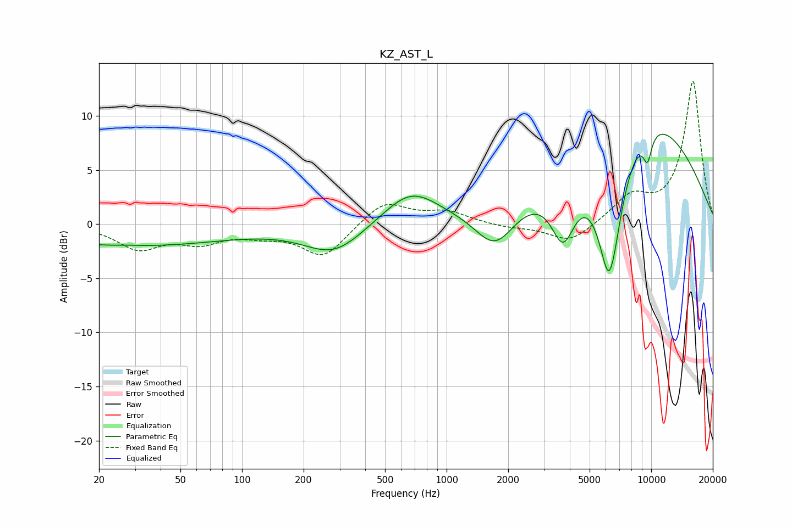

# KZ_AST_L
See [usage instructions](https://github.com/jaakkopasanen/AutoEq#usage) for more options and info.

### Parametric EQs
Apply preamp of -8.4 dB when using parametric equalizer.

|   # | Type    |   Fc (Hz) |    Q |   Gain (dB) |
|-----|---------|-----------|------|-------------|
|   1 | Peaking |        28 | 3.19 |         0.1 |
|   2 | Peaking |        29 | 0.28 |        -2   |
|   3 | Peaking |       281 | 0.98 |        -2.7 |
|   4 | Peaking |       668 | 1.04 |         3.1 |
|   5 | Peaking |      1728 | 1.43 |        -3.9 |
|   6 | Peaking |      3713 | 2.32 |        -5.7 |
|   7 | Peaking |      6273 | 2.22 |       -15.3 |
|   8 | Peaking |      6325 | 5.23 |         1.4 |
|   9 | Peaking |      8375 | 0.37 |        11.4 |
|  10 | Peaking |      9585 | 5.8  |        -2.5 |

### Fixed Band EQs
When using fixed band (also called graphic) equalizer, apply preamp of **-13.3 dB** (if available) and set gains manually with these parameters.

|   # | Type    |   Fc (Hz) |    Q |   Gain (dB) |
|-----|---------|-----------|------|-------------|
|   1 | Peaking |        31 | 1.41 |        -2.1 |
|   2 | Peaking |        62 | 1.41 |        -1.5 |
|   3 | Peaking |       125 | 1.41 |        -0.7 |
|   4 | Peaking |       250 | 1.41 |        -3   |
|   5 | Peaking |       500 | 1.41 |         2.2 |
|   6 | Peaking |      1000 | 1.41 |         1.1 |
|   7 | Peaking |      2000 | 1.41 |        -0.3 |
|   8 | Peaking |      4000 | 1.41 |        -1.8 |
|   9 | Peaking |      8000 | 1.41 |         2.3 |
|  10 | Peaking |     16000 | 1.41 |        13.2 |

### Graphs

