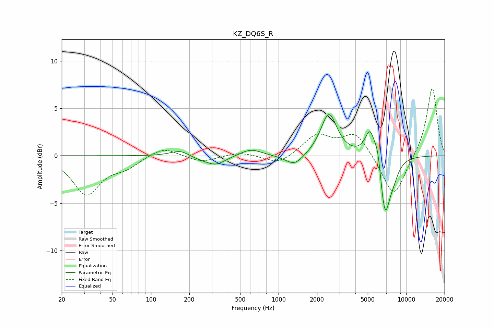

# KZ_DQ6S_R
See [usage instructions](https://github.com/jaakkopasanen/AutoEq#usage) for more options and info.

### Parametric EQs
Apply preamp of -4.4 dB when using parametric equalizer.

|   # | Type    |   Fc (Hz) |    Q |   Gain (dB) |
|-----|---------|-----------|------|-------------|
|   1 | Peaking |       171 | 1.83 |         0.7 |
|   2 | Peaking |       231 | 1.33 |        -0.4 |
|   3 | Peaking |       323 | 1.88 |        -0.9 |
|   4 | Peaking |       607 | 1.74 |         0.7 |
|   5 | Peaking |      1333 | 1.98 |        -1.2 |
|   6 | Peaking |      2480 | 2.25 |         4.5 |
|   7 | Peaking |      5225 | 3.41 |         3.1 |
|   8 | Peaking |      5991 | 6    |         1.7 |
|   9 | Peaking |      6818 | 3.59 |        -5.9 |
|  10 | Peaking |      7872 | 2.86 |        -1.6 |

### Fixed Band EQs
When using fixed band (also called graphic) equalizer, apply preamp of **-7.2 dB** (if available) and set gains manually with these parameters.

|   # | Type    |   Fc (Hz) |    Q |   Gain (dB) |
|-----|---------|-----------|------|-------------|
|   1 | Peaking |        31 | 1.41 |        -4   |
|   2 | Peaking |        62 | 1.41 |        -1   |
|   3 | Peaking |       125 | 1.41 |         1   |
|   4 | Peaking |       250 | 1.41 |        -0.7 |
|   5 | Peaking |       500 | 1.41 |         0.4 |
|   6 | Peaking |      1000 | 1.41 |        -1   |
|   7 | Peaking |      2000 | 1.41 |         2.1 |
|   8 | Peaking |      4000 | 1.41 |         2.4 |
|   9 | Peaking |      8000 | 1.41 |        -4.6 |
|  10 | Peaking |     16000 | 1.41 |         7.3 |

### Graphs

