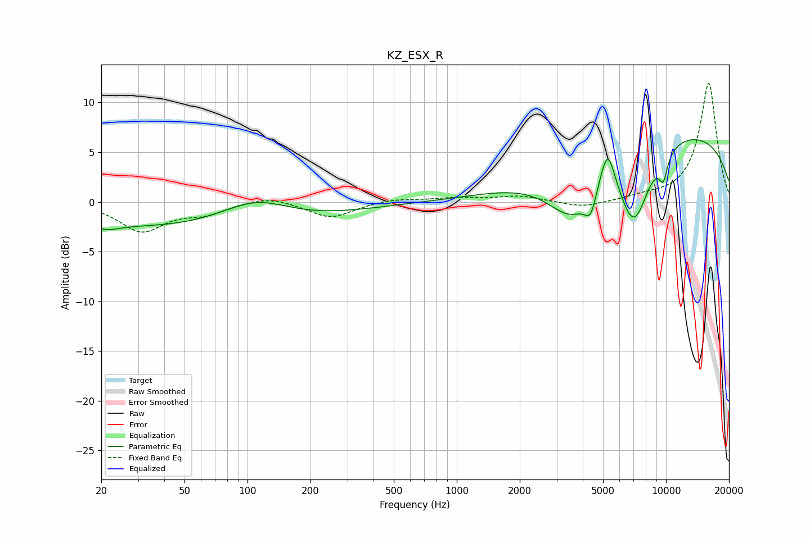

# KZ_ESX_R
See [usage instructions](https://github.com/jaakkopasanen/AutoEq#usage) for more options and info.

### Parametric EQs
Apply preamp of -6.4 dB when using parametric equalizer.

|   # | Type    |   Fc (Hz) |    Q |   Gain (dB) |
|-----|---------|-----------|------|-------------|
|   1 | Peaking |        21 | 2.14 |        -0.7 |
|   2 | Peaking |        60 | 0.21 |        -2.8 |
|   3 | Peaking |       109 | 0.84 |         2.5 |
|   4 | Peaking |      3564 | 1.12 |        -5.5 |
|   5 | Peaking |      4360 | 5.19 |        -2.2 |
|   6 | Peaking |      5252 | 3.86 |         4.4 |
|   7 | Peaking |      7035 | 1.78 |        -7.7 |
|   8 | Peaking |      9756 | 5.76 |        -3.7 |
|   9 | Peaking |      9853 | 6    |         1.2 |
|  10 | Peaking |     10000 | 0.21 |         7.3 |

### Fixed Band EQs
When using fixed band (also called graphic) equalizer, apply preamp of **-12.0 dB** (if available) and set gains manually with these parameters.

|   # | Type    |   Fc (Hz) |    Q |   Gain (dB) |
|-----|---------|-----------|------|-------------|
|   1 | Peaking |        31 | 1.41 |        -2.9 |
|   2 | Peaking |        62 | 1.41 |        -1   |
|   3 | Peaking |       125 | 1.41 |         0.7 |
|   4 | Peaking |       250 | 1.41 |        -1.6 |
|   5 | Peaking |       500 | 1.41 |         0.3 |
|   6 | Peaking |      1000 | 1.41 |         0.4 |
|   7 | Peaking |      2000 | 1.41 |         0.6 |
|   8 | Peaking |      4000 | 1.41 |        -0.6 |
|   9 | Peaking |      8000 | 1.41 |         0.4 |
|  10 | Peaking |     16000 | 1.41 |        12   |

### Graphs

