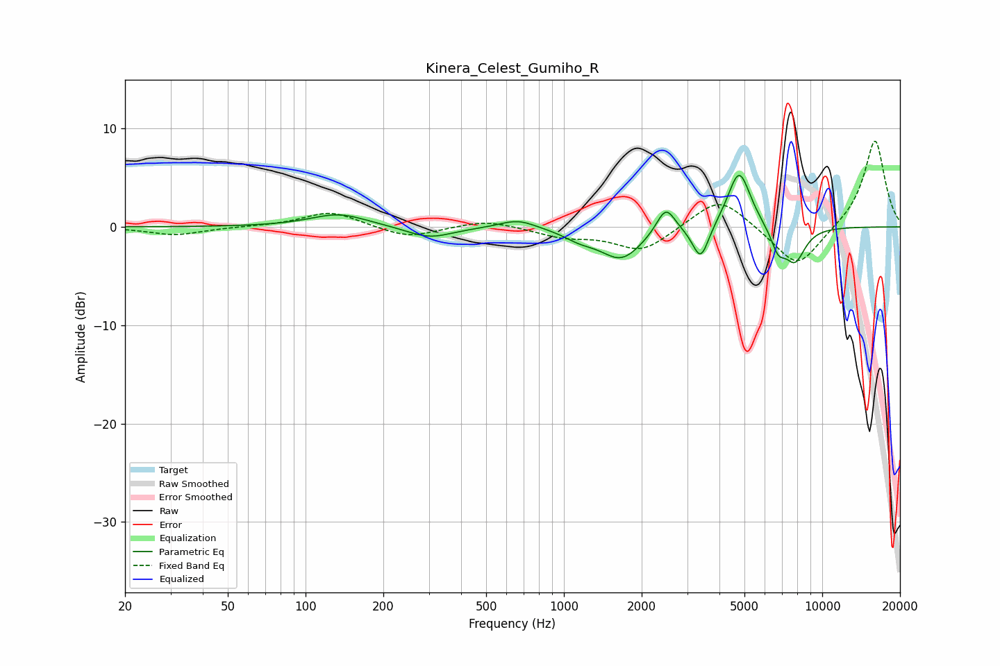

# Kinera_Celest_Gumiho_R
See [usage instructions](https://github.com/jaakkopasanen/AutoEq#usage) for more options and info.

### Parametric EQs
Apply preamp of -5.3 dB when using parametric equalizer.

|   # | Type    |   Fc (Hz) |    Q |   Gain (dB) |
|-----|---------|-----------|------|-------------|
|   1 | Peaking |       134 | 1.28 |         1.3 |
|   2 | Peaking |       302 | 1.59 |        -1.2 |
|   3 | Peaking |       663 | 2.01 |         0.9 |
|   4 | Peaking |      1152 | 2.26 |        -0.8 |
|   5 | Peaking |      1669 | 1.74 |        -3.2 |
|   6 | Peaking |      2479 | 3.94 |         2.7 |
|   7 | Peaking |      3384 | 4.4  |        -3.6 |
|   8 | Peaking |      4768 | 3.12 |         6   |
|   9 | Peaking |      6752 | 4.73 |        -2.2 |
|  10 | Peaking |      7841 | 3.27 |        -3.4 |

### Fixed Band EQs
When using fixed band (also called graphic) equalizer, apply preamp of **-8.8 dB** (if available) and set gains manually with these parameters.

|   # | Type    |   Fc (Hz) |    Q |   Gain (dB) |
|-----|---------|-----------|------|-------------|
|   1 | Peaking |        31 | 1.41 |        -0.8 |
|   2 | Peaking |        62 | 1.41 |         0   |
|   3 | Peaking |       125 | 1.41 |         1.6 |
|   4 | Peaking |       250 | 1.41 |        -1.2 |
|   5 | Peaking |       500 | 1.41 |         0.8 |
|   6 | Peaking |      1000 | 1.41 |        -0.9 |
|   7 | Peaking |      2000 | 1.41 |        -2.5 |
|   8 | Peaking |      4000 | 1.41 |         3.2 |
|   9 | Peaking |      8000 | 1.41 |        -4.3 |
|  10 | Peaking |     16000 | 1.41 |         9   |

### Graphs

