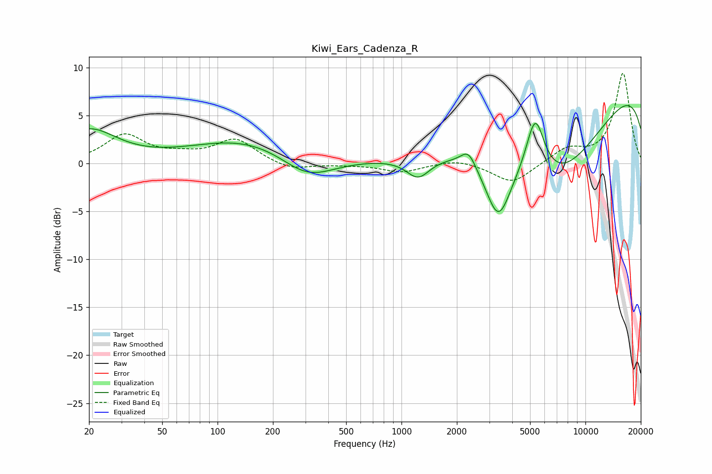

# Kiwi_Ears_Cadenza_R
See [usage instructions](https://github.com/jaakkopasanen/AutoEq#usage) for more options and info.

### Parametric EQs
Apply preamp of -6.1 dB when using parametric equalizer.

|   # | Type    |   Fc (Hz) |    Q |   Gain (dB) |
|-----|---------|-----------|------|-------------|
|   1 | Peaking |        20 | 0.95 |         3.4 |
|   2 | Peaking |       150 | 0.45 |         2.6 |
|   3 | Peaking |       306 | 0.95 |        -2.7 |
|   4 | Peaking |      1231 | 2.22 |        -2.1 |
|   5 | Peaking |      2150 | 2.6  |         0.1 |
|   6 | Peaking |      2318 | 3.55 |         1.6 |
|   7 | Peaking |      3360 | 2.08 |        -6.1 |
|   8 | Peaking |      5333 | 2.75 |         6.4 |
|   9 | Peaking |      6808 | 0.4  |       -12.2 |
|  10 | Peaking |     10000 | 0.18 |        11.6 |

### Fixed Band EQs
When using fixed band (also called graphic) equalizer, apply preamp of **-9.5 dB** (if available) and set gains manually with these parameters.

|   # | Type    |   Fc (Hz) |    Q |   Gain (dB) |
|-----|---------|-----------|------|-------------|
|   1 | Peaking |        31 | 1.41 |         2.9 |
|   2 | Peaking |        62 | 1.41 |         0.6 |
|   3 | Peaking |       125 | 1.41 |         2.5 |
|   4 | Peaking |       250 | 1.41 |        -0.8 |
|   5 | Peaking |       500 | 1.41 |        -0.1 |
|   6 | Peaking |      1000 | 1.41 |        -0.9 |
|   7 | Peaking |      2000 | 1.41 |         0.5 |
|   8 | Peaking |      4000 | 1.41 |        -2.1 |
|   9 | Peaking |      8000 | 1.41 |         1.5 |
|  10 | Peaking |     16000 | 1.41 |         9.4 |

### Graphs

