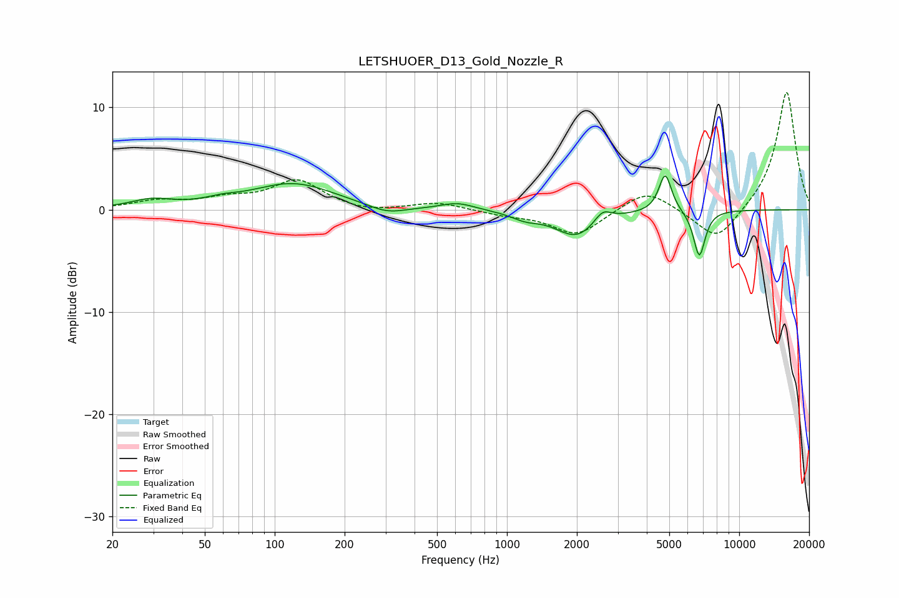

# LETSHUOER_D13_Gold_Nozzle_R
See [usage instructions](https://github.com/jaakkopasanen/AutoEq#usage) for more options and info.

### Parametric EQs
Apply preamp of -3.4 dB when using parametric equalizer.

|   # | Type    |   Fc (Hz) |    Q |   Gain (dB) |
|-----|---------|-----------|------|-------------|
|   1 | Peaking |        29 | 1.6  |         0.8 |
|   2 | Peaking |        59 | 1.97 |         0.4 |
|   3 | Peaking |       120 | 0.79 |         2.5 |
|   4 | Peaking |       304 | 1.75 |        -0.8 |
|   5 | Peaking |       614 | 1.95 |         0.7 |
|   6 | Peaking |      1198 | 2.35 |        -0.6 |
|   7 | Peaking |      1993 | 1.54 |        -2.6 |
|   8 | Peaking |      2581 | 3.84 |         1.2 |
|   9 | Peaking |      4802 | 5.17 |         3.8 |
|  10 | Peaking |      6736 | 5.41 |        -4.6 |

### Fixed Band EQs
When using fixed band (also called graphic) equalizer, apply preamp of **-11.6 dB** (if available) and set gains manually with these parameters.

|   # | Type    |   Fc (Hz) |    Q |   Gain (dB) |
|-----|---------|-----------|------|-------------|
|   1 | Peaking |        31 | 1.41 |         0.8 |
|   2 | Peaking |        62 | 1.41 |         0.9 |
|   3 | Peaking |       125 | 1.41 |         2.8 |
|   4 | Peaking |       250 | 1.41 |        -0.4 |
|   5 | Peaking |       500 | 1.41 |         0.7 |
|   6 | Peaking |      1000 | 1.41 |        -0.4 |
|   7 | Peaking |      2000 | 1.41 |        -2.5 |
|   8 | Peaking |      4000 | 1.41 |         2.1 |
|   9 | Peaking |      8000 | 1.41 |        -3.3 |
|  10 | Peaking |     16000 | 1.41 |        11.7 |

### Graphs

