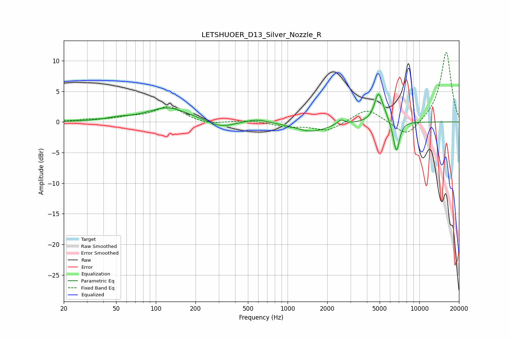

# LETSHUOER_D13_Silver_Nozzle_R
See [usage instructions](https://github.com/jaakkopasanen/AutoEq#usage) for more options and info.

### Parametric EQs
Apply preamp of -4.6 dB when using parametric equalizer.

|   # | Type    |   Fc (Hz) |    Q |   Gain (dB) |
|-----|---------|-----------|------|-------------|
|   1 | Peaking |        51 | 1.51 |         0.4 |
|   2 | Peaking |       123 | 0.92 |         2.3 |
|   3 | Peaking |       312 | 1.54 |        -1.1 |
|   4 | Peaking |       588 | 1.77 |         0.6 |
|   5 | Peaking |      1516 | 1.15 |        -1.6 |
|   6 | Peaking |      2538 | 5.14 |         0.8 |
|   7 | Peaking |      4876 | 4.71 |         4.1 |
|   8 | Peaking |      5315 | 3.47 |         1.2 |
|   9 | Peaking |      6446 | 5.26 |        -0.6 |
|  10 | Peaking |      6721 | 6    |        -4.6 |

### Fixed Band EQs
When using fixed band (also called graphic) equalizer, apply preamp of **-11.5 dB** (if available) and set gains manually with these parameters.

|   # | Type    |   Fc (Hz) |    Q |   Gain (dB) |
|-----|---------|-----------|------|-------------|
|   1 | Peaking |        31 | 1.41 |         0.3 |
|   2 | Peaking |        62 | 1.41 |         0.6 |
|   3 | Peaking |       125 | 1.41 |         2.5 |
|   4 | Peaking |       250 | 1.41 |        -0.5 |
|   5 | Peaking |       500 | 1.41 |         0.3 |
|   6 | Peaking |      1000 | 1.41 |        -0.7 |
|   7 | Peaking |      2000 | 1.41 |        -1.5 |
|   8 | Peaking |      4000 | 1.41 |         2.3 |
|   9 | Peaking |      8000 | 1.41 |        -2.6 |
|  10 | Peaking |     16000 | 1.41 |        11.5 |

### Graphs

