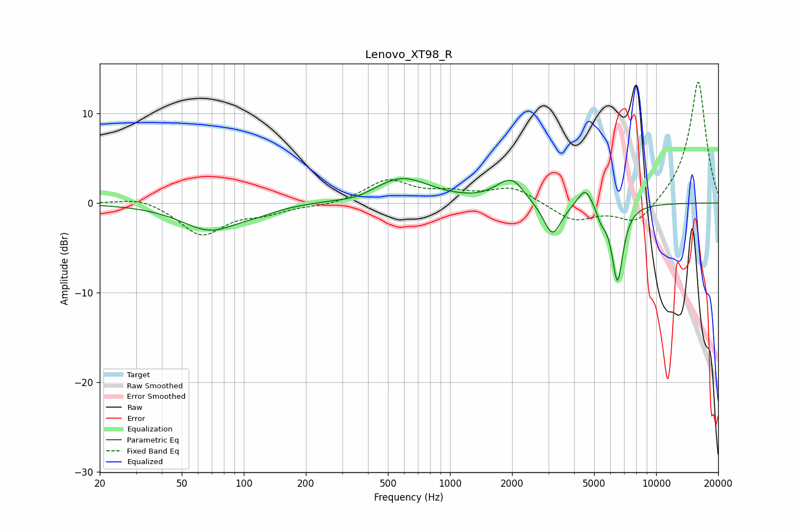

# Lenovo_XT98_R
See [usage instructions](https://github.com/jaakkopasanen/AutoEq#usage) for more options and info.

### Parametric EQs
Apply preamp of -2.8 dB when using parametric equalizer.

|   # | Type    |   Fc (Hz) |    Q |   Gain (dB) |
|-----|---------|-----------|------|-------------|
|   1 | Peaking |        69 | 1    |        -3   |
|   2 | Peaking |       119 | 1.76 |        -0.4 |
|   3 | Peaking |       351 | 1.88 |        -0.4 |
|   4 | Peaking |       583 | 1.02 |         2.8 |
|   5 | Peaking |      1904 | 2.13 |         2.1 |
|   6 | Peaking |      2097 | 3.9  |         0.7 |
|   7 | Peaking |      3140 | 3.26 |        -3.8 |
|   8 | Peaking |      4535 | 3.83 |         2.3 |
|   9 | Peaking |      5416 | 6    |        -1.2 |
|  10 | Peaking |      6492 | 4.94 |        -8.6 |

### Fixed Band EQs
When using fixed band (also called graphic) equalizer, apply preamp of **-13.6 dB** (if available) and set gains manually with these parameters.

|   # | Type    |   Fc (Hz) |    Q |   Gain (dB) |
|-----|---------|-----------|------|-------------|
|   1 | Peaking |        31 | 1.41 |         0.8 |
|   2 | Peaking |        62 | 1.41 |        -3.5 |
|   3 | Peaking |       125 | 1.41 |        -0.9 |
|   4 | Peaking |       250 | 1.41 |        -0.3 |
|   5 | Peaking |       500 | 1.41 |         2.5 |
|   6 | Peaking |      1000 | 1.41 |         0.9 |
|   7 | Peaking |      2000 | 1.41 |         1.7 |
|   8 | Peaking |      4000 | 1.41 |        -2   |
|   9 | Peaking |      8000 | 1.41 |        -2.5 |
|  10 | Peaking |     16000 | 1.41 |        13.7 |

### Graphs

