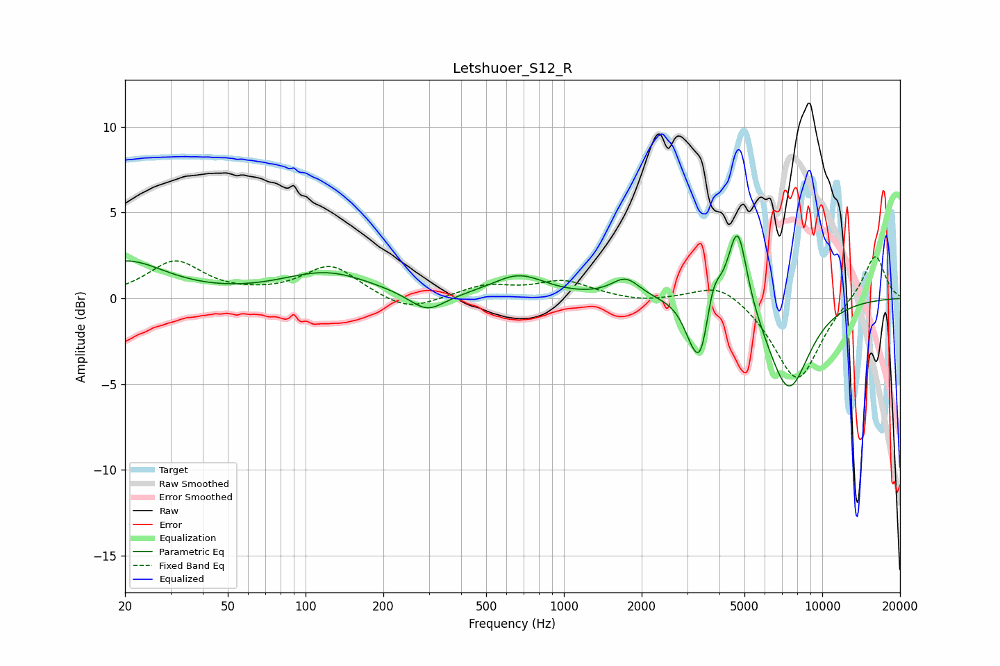

# Letshuoer_S12_R
See [usage instructions](https://github.com/jaakkopasanen/AutoEq#usage) for more options and info.

### Parametric EQs
Apply preamp of -3.7 dB when using parametric equalizer.

|   # | Type    |   Fc (Hz) |    Q |   Gain (dB) |
|-----|---------|-----------|------|-------------|
|   1 | Peaking |        20 | 0.91 |         2.1 |
|   2 | Peaking |       121 | 0.81 |         1.5 |
|   3 | Peaking |       296 | 2.04 |        -1.1 |
|   4 | Peaking |       670 | 1.36 |         1.3 |
|   5 | Peaking |      1735 | 2.56 |         1.1 |
|   6 | Peaking |      3090 | 4    |        -1.1 |
|   7 | Peaking |      3386 | 4.3  |        -3.3 |
|   8 | Peaking |      3786 | 4.86 |         1.7 |
|   9 | Peaking |      4705 | 3.73 |         5.1 |
|  10 | Peaking |      7401 | 1.62 |        -5.4 |

### Fixed Band EQs
When using fixed band (also called graphic) equalizer, apply preamp of **-2.5 dB** (if available) and set gains manually with these parameters.

|   # | Type    |   Fc (Hz) |    Q |   Gain (dB) |
|-----|---------|-----------|------|-------------|
|   1 | Peaking |        31 | 1.41 |         2.1 |
|   2 | Peaking |        62 | 1.41 |         0.1 |
|   3 | Peaking |       125 | 1.41 |         1.9 |
|   4 | Peaking |       250 | 1.41 |        -0.9 |
|   5 | Peaking |       500 | 1.41 |         0.7 |
|   6 | Peaking |      1000 | 1.41 |         1   |
|   7 | Peaking |      2000 | 1.41 |        -0.2 |
|   8 | Peaking |      4000 | 1.41 |         1.1 |
|   9 | Peaking |      8000 | 1.41 |        -4.9 |
|  10 | Peaking |     16000 | 1.41 |         2.7 |

### Graphs

