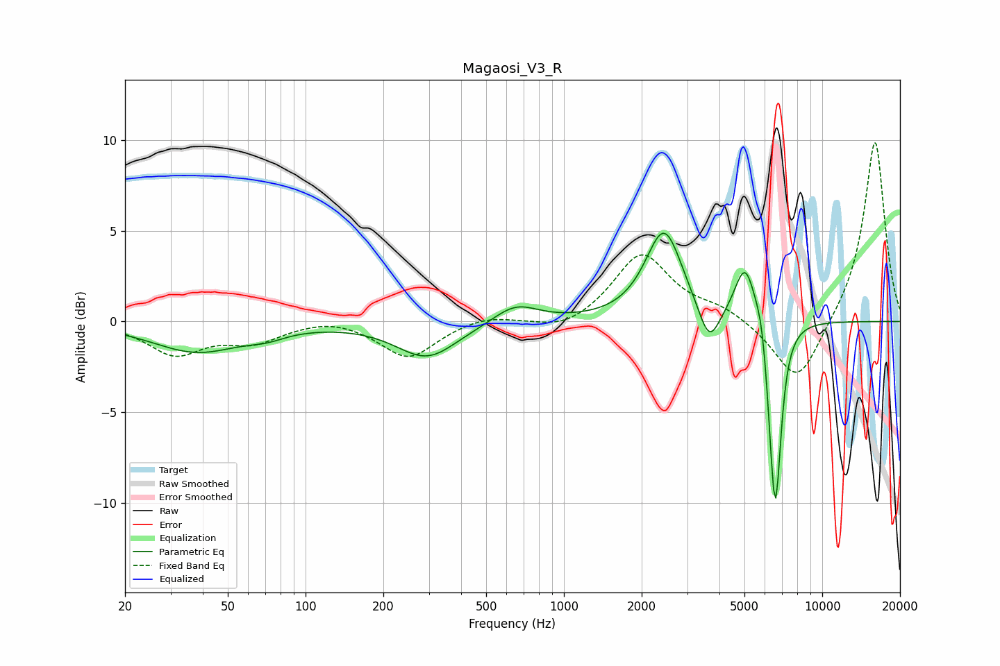

# Magaosi_V3_R
See [usage instructions](https://github.com/jaakkopasanen/AutoEq#usage) for more options and info.

### Parametric EQs
Apply preamp of -5.0 dB when using parametric equalizer.

|   # | Type    |   Fc (Hz) |    Q |   Gain (dB) |
|-----|---------|-----------|------|-------------|
|   1 | Peaking |        38 | 0.81 |        -1.6 |
|   2 | Peaking |        71 | 1.97 |        -0.3 |
|   3 | Peaking |       295 | 1.19 |        -2   |
|   4 | Peaking |       650 | 1.62 |         1.1 |
|   5 | Peaking |      2443 | 1.98 |         5   |
|   6 | Peaking |      3651 | 3.4  |        -2.2 |
|   7 | Peaking |      5035 | 3.39 |         3.2 |
|   8 | Peaking |      5845 | 5.98 |         1.2 |
|   9 | Peaking |      6369 | 6    |        -1.8 |
|  10 | Peaking |      6597 | 6    |        -9.4 |

### Fixed Band EQs
When using fixed band (also called graphic) equalizer, apply preamp of **-10.0 dB** (if available) and set gains manually with these parameters.

|   # | Type    |   Fc (Hz) |    Q |   Gain (dB) |
|-----|---------|-----------|------|-------------|
|   1 | Peaking |        31 | 1.41 |        -1.7 |
|   2 | Peaking |        62 | 1.41 |        -1   |
|   3 | Peaking |       125 | 1.41 |         0.3 |
|   4 | Peaking |       250 | 1.41 |        -2   |
|   5 | Peaking |       500 | 1.41 |         0.4 |
|   6 | Peaking |      1000 | 1.41 |        -0.6 |
|   7 | Peaking |      2000 | 1.41 |         3.7 |
|   8 | Peaking |      4000 | 1.41 |         0.7 |
|   9 | Peaking |      8000 | 1.41 |        -3.6 |
|  10 | Peaking |     16000 | 1.41 |        10.1 |

### Graphs

