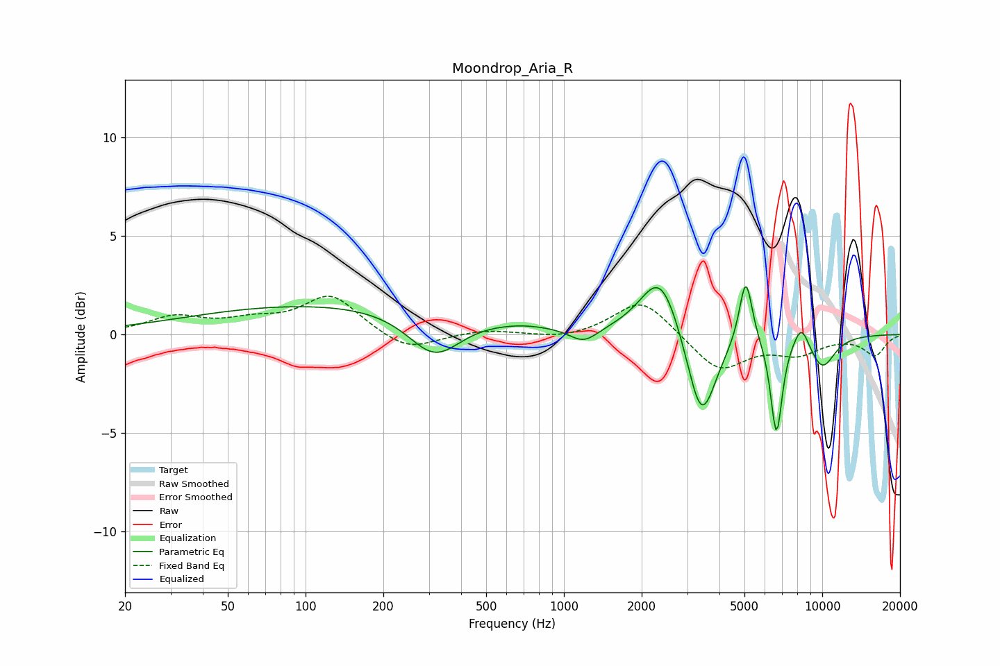

# Moondrop_Aria_R
See [usage instructions](https://github.com/jaakkopasanen/AutoEq#usage) for more options and info.

### Parametric EQs
Apply preamp of -2.5 dB when using parametric equalizer.

|   # | Type    |   Fc (Hz) |    Q |   Gain (dB) |
|-----|---------|-----------|------|-------------|
|   1 | Peaking |       142 | 0.23 |         1.6 |
|   2 | Peaking |       316 | 1.36 |        -2.3 |
|   3 | Peaking |       697 | 2.01 |         0.1 |
|   4 | Peaking |      1193 | 2.48 |        -0.8 |
|   5 | Peaking |      2364 | 1.82 |         3.3 |
|   6 | Peaking |      3406 | 2.49 |        -4.8 |
|   7 | Peaking |      5059 | 5.53 |         3.4 |
|   8 | Peaking |      6649 | 6    |        -5   |
|   9 | Peaking |      8304 | 4.34 |         1.2 |
|  10 | Peaking |     10000 | 2.38 |        -1.6 |

### Fixed Band EQs
When using fixed band (also called graphic) equalizer, apply preamp of **-2.0 dB** (if available) and set gains manually with these parameters.

|   # | Type    |   Fc (Hz) |    Q |   Gain (dB) |
|-----|---------|-----------|------|-------------|
|   1 | Peaking |        31 | 1.41 |         0.8 |
|   2 | Peaking |        62 | 1.41 |         0.6 |
|   3 | Peaking |       125 | 1.41 |         2   |
|   4 | Peaking |       250 | 1.41 |        -0.9 |
|   5 | Peaking |       500 | 1.41 |         0.2 |
|   6 | Peaking |      1000 | 1.41 |        -0.3 |
|   7 | Peaking |      2000 | 1.41 |         1.9 |
|   8 | Peaking |      4000 | 1.41 |        -1.9 |
|   9 | Peaking |      8000 | 1.41 |        -0.9 |
|  10 | Peaking |     16000 | 1.41 |        -1   |

### Graphs

