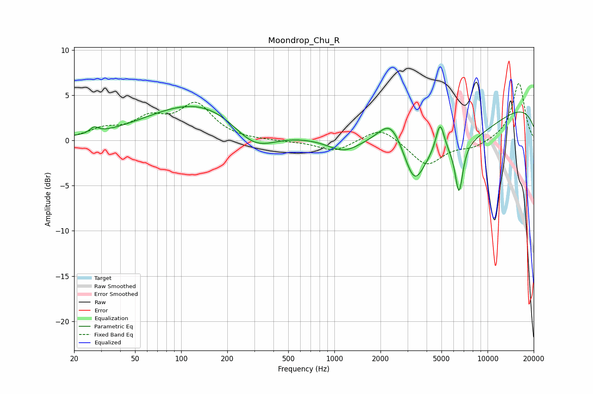

# Moondrop_Chu_R
See [usage instructions](https://github.com/jaakkopasanen/AutoEq#usage) for more options and info.

### Parametric EQs
Apply preamp of -3.9 dB when using parametric equalizer.

|   # | Type    |   Fc (Hz) |    Q |   Gain (dB) |
|-----|---------|-----------|------|-------------|
|   1 | Peaking |        27 | 5.48 |         0.6 |
|   2 | Peaking |       148 | 0.39 |         4.6 |
|   3 | Peaking |       297 | 0.93 |        -3.5 |
|   4 | Peaking |      1150 | 1.37 |        -1.4 |
|   5 | Peaking |      2339 | 1.77 |         3   |
|   6 | Peaking |      3323 | 2.11 |        -4.5 |
|   7 | Peaking |      4897 | 5.03 |         3.4 |
|   8 | Peaking |      5473 | 0.4  |        -4.8 |
|   9 | Peaking |      6508 | 5.38 |        -5.4 |
|  10 | Peaking |     10000 | 0.18 |         4.7 |

### Fixed Band EQs
When using fixed band (also called graphic) equalizer, apply preamp of **-6.4 dB** (if available) and set gains manually with these parameters.

|   # | Type    |   Fc (Hz) |    Q |   Gain (dB) |
|-----|---------|-----------|------|-------------|
|   1 | Peaking |        31 | 1.41 |         1.1 |
|   2 | Peaking |        62 | 1.41 |         2.1 |
|   3 | Peaking |       125 | 1.41 |         3.8 |
|   4 | Peaking |       250 | 1.41 |        -0   |
|   5 | Peaking |       500 | 1.41 |        -0.1 |
|   6 | Peaking |      1000 | 1.41 |        -1.2 |
|   7 | Peaking |      2000 | 1.41 |         1.6 |
|   8 | Peaking |      4000 | 1.41 |        -2.8 |
|   9 | Peaking |      8000 | 1.41 |        -0.7 |
|  10 | Peaking |     16000 | 1.41 |         6.4 |

### Graphs

