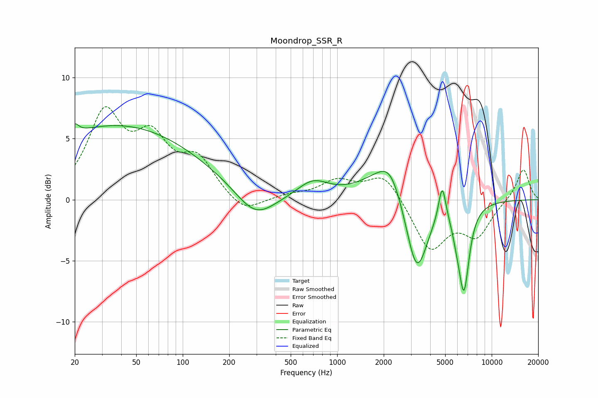

# Moondrop_SSR_R
See [usage instructions](https://github.com/jaakkopasanen/AutoEq#usage) for more options and info.

### Parametric EQs
Apply preamp of -6.3 dB when using parametric equalizer.

|   # | Type    |   Fc (Hz) |    Q |   Gain (dB) |
|-----|---------|-----------|------|-------------|
|   1 | Peaking |        20 | 5.67 |         0.8 |
|   2 | Peaking |        38 | 0.26 |         6.1 |
|   3 | Peaking |       295 | 1.12 |        -2.3 |
|   4 | Peaking |       696 | 1.4  |         1.4 |
|   5 | Peaking |      2035 | 0.96 |         2.3 |
|   6 | Peaking |      2215 | 2.11 |         1.5 |
|   7 | Peaking |      3270 | 1.97 |        -6.7 |
|   8 | Peaking |      4785 | 6    |         3   |
|   9 | Peaking |      5902 | 5.2  |        -0.8 |
|  10 | Peaking |      6606 | 3.88 |        -7   |

### Fixed Band EQs
When using fixed band (also called graphic) equalizer, apply preamp of **-7.7 dB** (if available) and set gains manually with these parameters.

|   # | Type    |   Fc (Hz) |    Q |   Gain (dB) |
|-----|---------|-----------|------|-------------|
|   1 | Peaking |        31 | 1.41 |         6.7 |
|   2 | Peaking |        62 | 1.41 |         4.3 |
|   3 | Peaking |       125 | 1.41 |         3   |
|   4 | Peaking |       250 | 1.41 |        -1.3 |
|   5 | Peaking |       500 | 1.41 |         0.3 |
|   6 | Peaking |      1000 | 1.41 |         1.4 |
|   7 | Peaking |      2000 | 1.41 |         2.2 |
|   8 | Peaking |      4000 | 1.41 |        -4.1 |
|   9 | Peaking |      8000 | 1.41 |        -2.8 |
|  10 | Peaking |     16000 | 1.41 |         2.6 |

### Graphs

