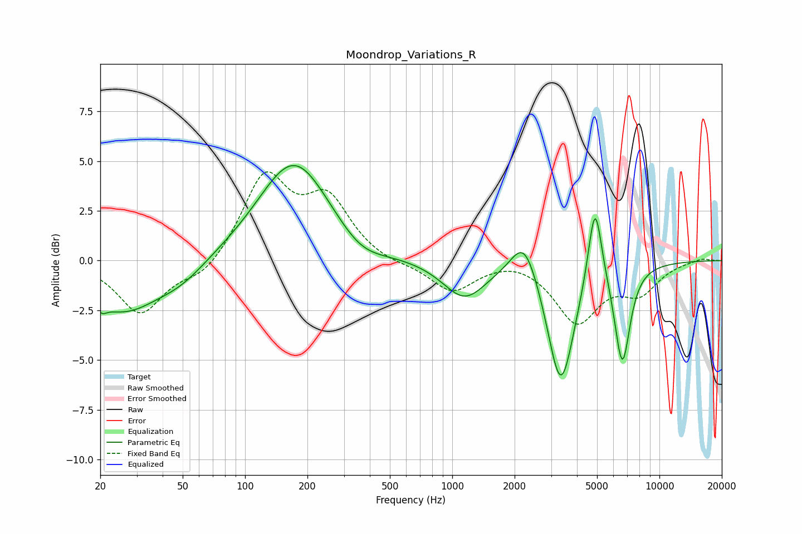

# Moondrop_Variations_R
See [usage instructions](https://github.com/jaakkopasanen/AutoEq#usage) for more options and info.

### Parametric EQs
Apply preamp of -4.9 dB when using parametric equalizer.

|   # | Type    |   Fc (Hz) |    Q |   Gain (dB) |
|-----|---------|-----------|------|-------------|
|   1 | Peaking |        20 | 5.97 |        -0.4 |
|   2 | Peaking |        26 | 0.78 |        -2.5 |
|   3 | Peaking |        49 | 1.17 |        -0.7 |
|   4 | Peaking |       173 | 0.82 |         5.1 |
|   5 | Peaking |       361 | 1.23 |        -0.9 |
|   6 | Peaking |      1146 | 1.36 |        -1.9 |
|   7 | Peaking |      2228 | 2.23 |         2.1 |
|   8 | Peaking |      3343 | 2.2  |        -6.3 |
|   9 | Peaking |      4886 | 4.26 |         4.3 |
|  10 | Peaking |      6620 | 3.61 |        -5   |

### Fixed Band EQs
When using fixed band (also called graphic) equalizer, apply preamp of **-4.6 dB** (if available) and set gains manually with these parameters.

|   # | Type    |   Fc (Hz) |    Q |   Gain (dB) |
|-----|---------|-----------|------|-------------|
|   1 | Peaking |        31 | 1.41 |        -2.6 |
|   2 | Peaking |        62 | 1.41 |        -0.9 |
|   3 | Peaking |       125 | 1.41 |         4.2 |
|   4 | Peaking |       250 | 1.41 |         2.9 |
|   5 | Peaking |       500 | 1.41 |        -0.2 |
|   6 | Peaking |      1000 | 1.41 |        -1.5 |
|   7 | Peaking |      2000 | 1.41 |         0.2 |
|   8 | Peaking |      4000 | 1.41 |        -3   |
|   9 | Peaking |      8000 | 1.41 |        -1.4 |
|  10 | Peaking |     16000 | 1.41 |         0.2 |

### Graphs

