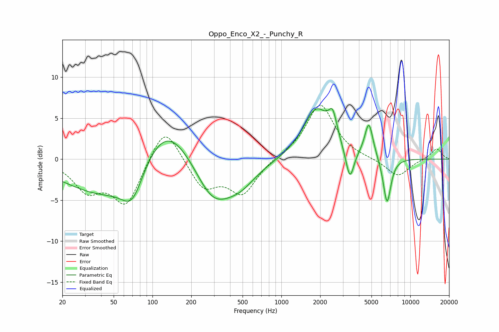

# Oppo_Enco_X2_-_Punchy_R
See [usage instructions](https://github.com/jaakkopasanen/AutoEq#usage) for more options and info.

### Parametric EQs
Apply preamp of -6.3 dB when using parametric equalizer.

|   # | Type    |   Fc (Hz) |    Q |   Gain (dB) |
|-----|---------|-----------|------|-------------|
|   1 | Peaking |        53 | 0.4  |        -5.6 |
|   2 | Peaking |        70 | 1.75 |        -3.7 |
|   3 | Peaking |       124 | 0.66 |         7.6 |
|   4 | Peaking |       293 | 0.97 |        -5.5 |
|   5 | Peaking |       478 | 1.1  |        -2.3 |
|   6 | Peaking |      1866 | 1.38 |         6   |
|   7 | Peaking |      2504 | 4.35 |         3   |
|   8 | Peaking |      3399 | 4.49 |        -3.9 |
|   9 | Peaking |      4774 | 4.29 |         4.3 |
|  10 | Peaking |      6603 | 4.5  |        -5.7 |

### Fixed Band EQs
When using fixed band (also called graphic) equalizer, apply preamp of **-6.7 dB** (if available) and set gains manually with these parameters.

|   # | Type    |   Fc (Hz) |    Q |   Gain (dB) |
|-----|---------|-----------|------|-------------|
|   1 | Peaking |        31 | 1.41 |        -3.5 |
|   2 | Peaking |        62 | 1.41 |        -5.5 |
|   3 | Peaking |       125 | 1.41 |         4.6 |
|   4 | Peaking |       250 | 1.41 |        -3.5 |
|   5 | Peaking |       500 | 1.41 |        -4.1 |
|   6 | Peaking |      1000 | 1.41 |         0.3 |
|   7 | Peaking |      2000 | 1.41 |         6.7 |
|   8 | Peaking |      4000 | 1.41 |         0   |
|   9 | Peaking |      8000 | 1.41 |        -2.2 |
|  10 | Peaking |     16000 | 1.41 |         1.3 |

### Graphs

