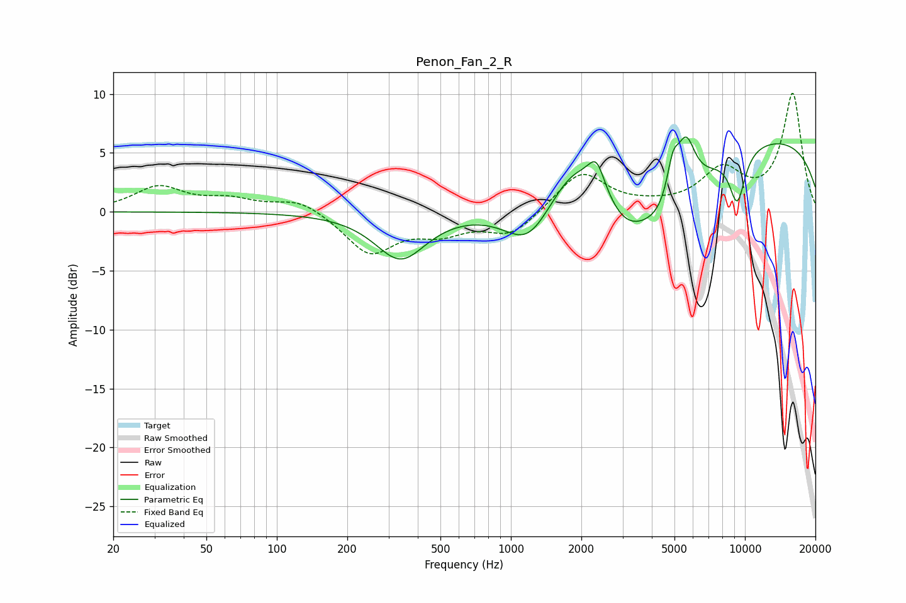

# Penon_Fan_2_R
See [usage instructions](https://github.com/jaakkopasanen/AutoEq#usage) for more options and info.

### Parametric EQs
Apply preamp of -6.4 dB when using parametric equalizer.

|   # | Type    |   Fc (Hz) |    Q |   Gain (dB) |
|-----|---------|-----------|------|-------------|
|   1 | Peaking |       338 | 1.31 |        -4   |
|   2 | Peaking |      1192 | 1.34 |        -3.9 |
|   3 | Peaking |      1880 | 1.27 |         3.2 |
|   4 | Peaking |      2324 | 4.11 |         2.4 |
|   5 | Peaking |      3052 | 1.46 |        -2.9 |
|   6 | Peaking |      4571 | 0.86 |        -6.1 |
|   7 | Peaking |      4920 | 5.4  |         3.1 |
|   8 | Peaking |      5593 | 3.35 |         4.9 |
|   9 | Peaking |      9272 | 3.7  |        -4.3 |
|  10 | Peaking |      9423 | 0.18 |         6.8 |

### Fixed Band EQs
When using fixed band (also called graphic) equalizer, apply preamp of **-10.2 dB** (if available) and set gains manually with these parameters.

|   # | Type    |   Fc (Hz) |    Q |   Gain (dB) |
|-----|---------|-----------|------|-------------|
|   1 | Peaking |        31 | 1.41 |         2.1 |
|   2 | Peaking |        62 | 1.41 |         0.9 |
|   3 | Peaking |       125 | 1.41 |         1.1 |
|   4 | Peaking |       250 | 1.41 |        -3.5 |
|   5 | Peaking |       500 | 1.41 |        -1.5 |
|   6 | Peaking |      1000 | 1.41 |        -2   |
|   7 | Peaking |      2000 | 1.41 |         3.4 |
|   8 | Peaking |      4000 | 1.41 |         0.3 |
|   9 | Peaking |      8000 | 1.41 |         3.3 |
|  10 | Peaking |     16000 | 1.41 |        10   |

### Graphs

