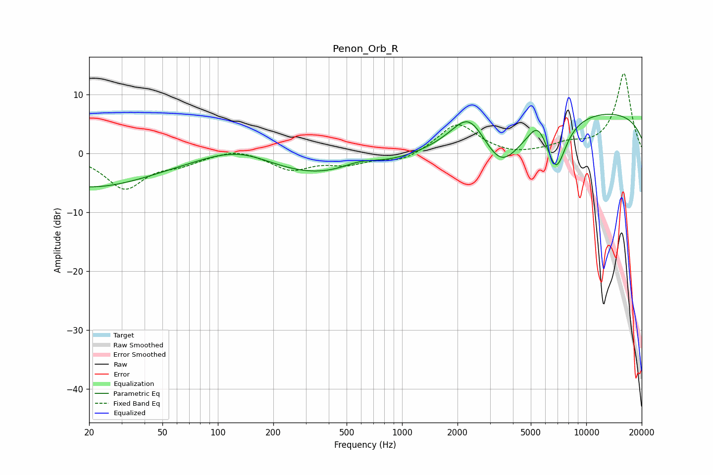

# Penon_Orb_R
See [usage instructions](https://github.com/jaakkopasanen/AutoEq#usage) for more options and info.

### Parametric EQs
Apply preamp of -6.7 dB when using parametric equalizer.

|   # | Type    |   Fc (Hz) |    Q |   Gain (dB) |
|-----|---------|-----------|------|-------------|
|   1 | Peaking |        20 | 0.4  |        -5.7 |
|   2 | Peaking |       131 | 0.72 |         3.1 |
|   3 | Peaking |       136 | 0.32 |        -0.4 |
|   4 | Peaking |       385 | 0.37 |        -4.3 |
|   5 | Peaking |       589 | 1.25 |         1.8 |
|   6 | Peaking |      2307 | 1.52 |         5.7 |
|   7 | Peaking |      3449 | 1.25 |        -7.6 |
|   8 | Peaking |      5455 | 2.95 |         3   |
|   9 | Peaking |      6865 | 2.41 |        -8.6 |
|  10 | Peaking |     10000 | 0.18 |         7.3 |

### Fixed Band EQs
When using fixed band (also called graphic) equalizer, apply preamp of **-13.6 dB** (if available) and set gains manually with these parameters.

|   # | Type    |   Fc (Hz) |    Q |   Gain (dB) |
|-----|---------|-----------|------|-------------|
|   1 | Peaking |        31 | 1.41 |        -5.8 |
|   2 | Peaking |        62 | 1.41 |        -1.5 |
|   3 | Peaking |       125 | 1.41 |         1   |
|   4 | Peaking |       250 | 1.41 |        -2.7 |
|   5 | Peaking |       500 | 1.41 |        -1.6 |
|   6 | Peaking |      1000 | 1.41 |        -1.4 |
|   7 | Peaking |      2000 | 1.41 |         5.2 |
|   8 | Peaking |      4000 | 1.41 |        -0.6 |
|   9 | Peaking |      8000 | 1.41 |         1.3 |
|  10 | Peaking |     16000 | 1.41 |        13.6 |

### Graphs

