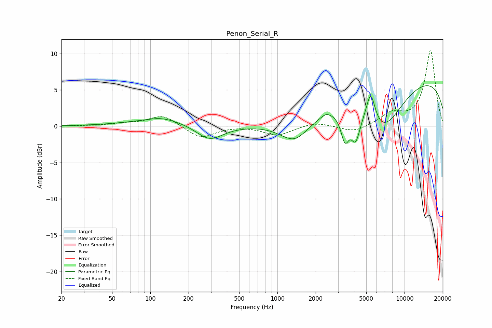

# Penon_Serial_R
See [usage instructions](https://github.com/jaakkopasanen/AutoEq#usage) for more options and info.

### Parametric EQs
Apply preamp of -5.7 dB when using parametric equalizer.

|   # | Type    |   Fc (Hz) |    Q |   Gain (dB) |
|-----|---------|-----------|------|-------------|
|   1 | Peaking |       122 | 1.49 |         0.4 |
|   2 | Peaking |       129 | 0.53 |         0.9 |
|   3 | Peaking |       292 | 1.32 |        -2.2 |
|   4 | Peaking |      1377 | 1.2  |        -3.3 |
|   5 | Peaking |      2409 | 4.3  |         0.4 |
|   6 | Peaking |      3397 | 4.4  |        -3.8 |
|   7 | Peaking |      4117 | 3.97 |        -3.7 |
|   8 | Peaking |      5421 | 3.94 |         4.4 |
|   9 | Peaking |      6667 | 0.81 |        -6.8 |
|  10 | Peaking |     10000 | 0.18 |         7.1 |

### Fixed Band EQs
When using fixed band (also called graphic) equalizer, apply preamp of **-10.5 dB** (if available) and set gains manually with these parameters.

|   # | Type    |   Fc (Hz) |    Q |   Gain (dB) |
|-----|---------|-----------|------|-------------|
|   1 | Peaking |        31 | 1.41 |         0   |
|   2 | Peaking |        62 | 1.41 |         0.3 |
|   3 | Peaking |       125 | 1.41 |         1.6 |
|   4 | Peaking |       250 | 1.41 |        -1.7 |
|   5 | Peaking |       500 | 1.41 |         0.1 |
|   6 | Peaking |      1000 | 1.41 |        -1.3 |
|   7 | Peaking |      2000 | 1.41 |         0.6 |
|   8 | Peaking |      4000 | 1.41 |        -0.9 |
|   9 | Peaking |      8000 | 1.41 |         1.6 |
|  10 | Peaking |     16000 | 1.41 |        10.4 |

### Graphs

