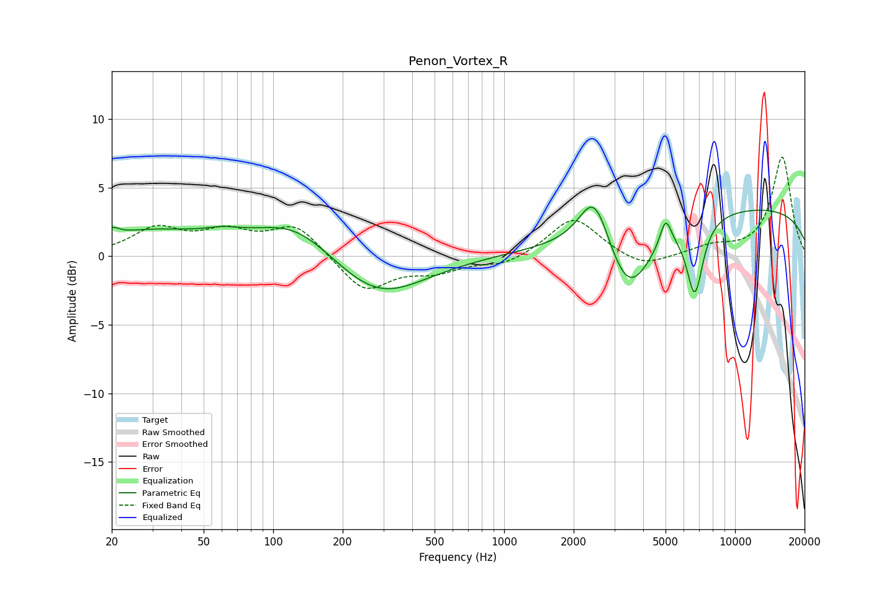

# Penon_Vortex_R
See [usage instructions](https://github.com/jaakkopasanen/AutoEq#usage) for more options and info.

### Parametric EQs
Apply preamp of -3.7 dB when using parametric equalizer.

|   # | Type    |   Fc (Hz) |    Q |   Gain (dB) |
|-----|---------|-----------|------|-------------|
|   1 | Peaking |        20 | 4.8  |         0.6 |
|   2 | Peaking |        29 | 0.58 |         1.7 |
|   3 | Peaking |        61 | 1.68 |         0.5 |
|   4 | Peaking |       124 | 0.81 |         2.6 |
|   5 | Peaking |       285 | 0.72 |        -3.2 |
|   6 | Peaking |      2464 | 2.12 |         4.3 |
|   7 | Peaking |      3457 | 1.39 |        -5.4 |
|   8 | Peaking |      5002 | 5.78 |         2   |
|   9 | Peaking |      6694 | 3.84 |        -5.4 |
|  10 | Peaking |     10000 | 0.19 |         3.6 |

### Fixed Band EQs
When using fixed band (also called graphic) equalizer, apply preamp of **-7.3 dB** (if available) and set gains manually with these parameters.

|   # | Type    |   Fc (Hz) |    Q |   Gain (dB) |
|-----|---------|-----------|------|-------------|
|   1 | Peaking |        31 | 1.41 |         1.9 |
|   2 | Peaking |        62 | 1.41 |         1.5 |
|   3 | Peaking |       125 | 1.41 |         2.2 |
|   4 | Peaking |       250 | 1.41 |        -2.6 |
|   5 | Peaking |       500 | 1.41 |        -1   |
|   6 | Peaking |      1000 | 1.41 |        -0.7 |
|   7 | Peaking |      2000 | 1.41 |         2.9 |
|   8 | Peaking |      4000 | 1.41 |        -0.9 |
|   9 | Peaking |      8000 | 1.41 |         0.6 |
|  10 | Peaking |     16000 | 1.41 |         7.2 |

### Graphs

