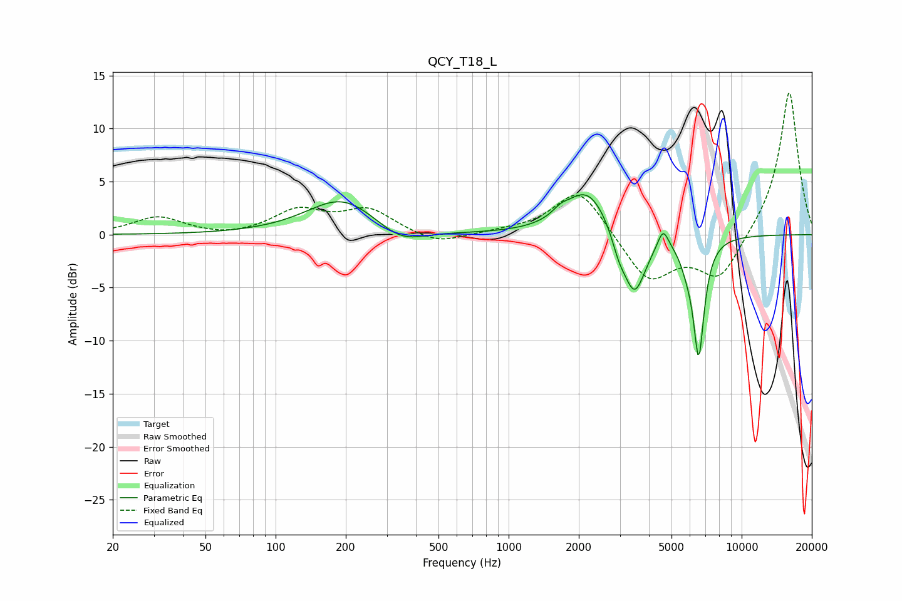

# QCY_T18_L
See [usage instructions](https://github.com/jaakkopasanen/AutoEq#usage) for more options and info.

### Parametric EQs
Apply preamp of -3.9 dB when using parametric equalizer.

|   # | Type    |   Fc (Hz) |    Q |   Gain (dB) |
|-----|---------|-----------|------|-------------|
|   1 | Peaking |       194 | 0.93 |         3.5 |
|   2 | Peaking |       343 | 1.38 |        -1.6 |
|   3 | Peaking |      1668 | 4.21 |         0.6 |
|   4 | Peaking |      2140 | 1.51 |         0.8 |
|   5 | Peaking |      2188 | 1.48 |         3.7 |
|   6 | Peaking |      2965 | 4.71 |        -1.5 |
|   7 | Peaking |      3463 | 2.84 |        -6   |
|   8 | Peaking |      4600 | 6    |         1.9 |
|   9 | Peaking |      5822 | 4.83 |        -1.3 |
|  10 | Peaking |      6542 | 5.7  |       -11   |

### Fixed Band EQs
When using fixed band (also called graphic) equalizer, apply preamp of **-13.5 dB** (if available) and set gains manually with these parameters.

|   # | Type    |   Fc (Hz) |    Q |   Gain (dB) |
|-----|---------|-----------|------|-------------|
|   1 | Peaking |        31 | 1.41 |         1.6 |
|   2 | Peaking |        62 | 1.41 |        -0.3 |
|   3 | Peaking |       125 | 1.41 |         2.2 |
|   4 | Peaking |       250 | 1.41 |         2.3 |
|   5 | Peaking |       500 | 1.41 |        -1   |
|   6 | Peaking |      1000 | 1.41 |         0.2 |
|   7 | Peaking |      2000 | 1.41 |         4.5 |
|   8 | Peaking |      4000 | 1.41 |        -4.5 |
|   9 | Peaking |      8000 | 1.41 |        -4.2 |
|  10 | Peaking |     16000 | 1.41 |        13.7 |

### Graphs

