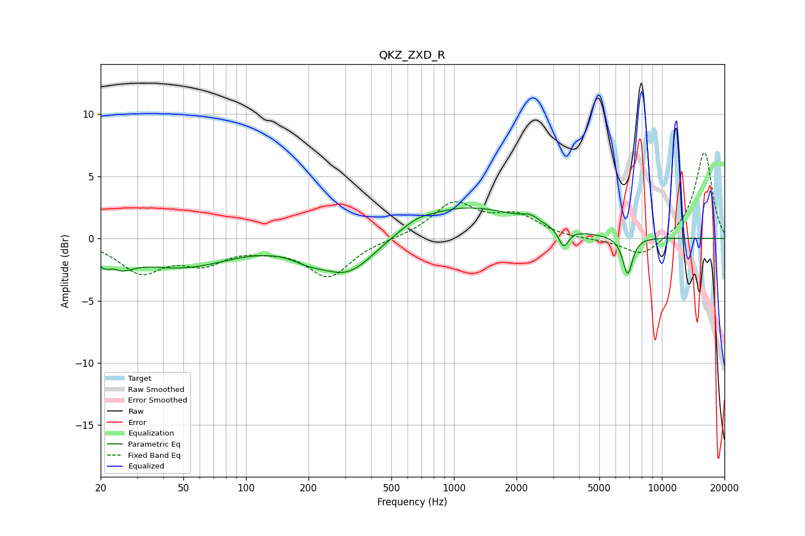

# QKZ_ZXD_R
See [usage instructions](https://github.com/jaakkopasanen/AutoEq#usage) for more options and info.

### Parametric EQs
Apply preamp of -2.6 dB when using parametric equalizer.

|   # | Type    |   Fc (Hz) |    Q |   Gain (dB) |
|-----|---------|-----------|------|-------------|
|   1 | Peaking |        23 | 2.1  |        -2.4 |
|   2 | Peaking |        23 | 4.25 |         1   |
|   3 | Peaking |        50 | 0.62 |        -2.1 |
|   4 | Peaking |       198 | 1.83 |        -0.6 |
|   5 | Peaking |       311 | 1.04 |        -3.1 |
|   6 | Peaking |       664 | 2.28 |         0.3 |
|   7 | Peaking |      1110 | 0.5  |         2.7 |
|   8 | Peaking |      2330 | 3.8  |         0.5 |
|   9 | Peaking |      3369 | 6    |        -1.5 |
|  10 | Peaking |      6845 | 5.7  |        -3   |

### Fixed Band EQs
When using fixed band (also called graphic) equalizer, apply preamp of **-7.0 dB** (if available) and set gains manually with these parameters.

|   # | Type    |   Fc (Hz) |    Q |   Gain (dB) |
|-----|---------|-----------|------|-------------|
|   1 | Peaking |        31 | 1.41 |        -2.6 |
|   2 | Peaking |        62 | 1.41 |        -1.7 |
|   3 | Peaking |       125 | 1.41 |        -0.5 |
|   4 | Peaking |       250 | 1.41 |        -3   |
|   5 | Peaking |       500 | 1.41 |        -0   |
|   6 | Peaking |      1000 | 1.41 |         2.8 |
|   7 | Peaking |      2000 | 1.41 |         1.7 |
|   8 | Peaking |      4000 | 1.41 |        -0.1 |
|   9 | Peaking |      8000 | 1.41 |        -1.5 |
|  10 | Peaking |     16000 | 1.41 |         7   |

### Graphs

