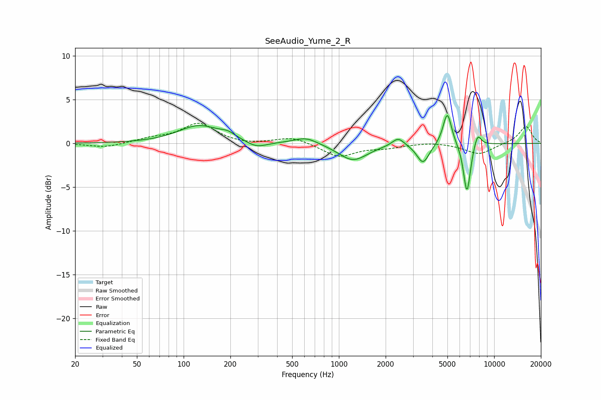

# SeeAudio_Yume_2_R
See [usage instructions](https://github.com/jaakkopasanen/AutoEq#usage) for more options and info.

### Parametric EQs
Apply preamp of -3.3 dB when using parametric equalizer.

|   # | Type    |   Fc (Hz) |    Q |   Gain (dB) |
|-----|---------|-----------|------|-------------|
|   1 | Peaking |       126 | 1.05 |         2   |
|   2 | Peaking |       193 | 2.9  |         0.5 |
|   3 | Peaking |       295 | 2.15 |        -0.7 |
|   4 | Peaking |       614 | 1.86 |         0.8 |
|   5 | Peaking |      1232 | 1.52 |        -1.9 |
|   6 | Peaking |      2408 | 3.64 |         1   |
|   7 | Peaking |      3482 | 3.58 |        -2.2 |
|   8 | Peaking |      4992 | 5.04 |         3.8 |
|   9 | Peaking |      6681 | 5.98 |        -5.8 |
|  10 | Peaking |      7820 | 5.63 |         1.6 |

### Fixed Band EQs
When using fixed band (also called graphic) equalizer, apply preamp of **-2.4 dB** (if available) and set gains manually with these parameters.

|   # | Type    |   Fc (Hz) |    Q |   Gain (dB) |
|-----|---------|-----------|------|-------------|
|   1 | Peaking |        31 | 1.41 |        -0.5 |
|   2 | Peaking |        62 | 1.41 |         0.5 |
|   3 | Peaking |       125 | 1.41 |         2.2 |
|   4 | Peaking |       250 | 1.41 |        -0.2 |
|   5 | Peaking |       500 | 1.41 |         0.8 |
|   6 | Peaking |      1000 | 1.41 |        -1.5 |
|   7 | Peaking |      2000 | 1.41 |        -0.4 |
|   8 | Peaking |      4000 | 1.41 |         0.2 |
|   9 | Peaking |      8000 | 1.41 |        -1.2 |
|  10 | Peaking |     16000 | 1.41 |         2   |

### Graphs

