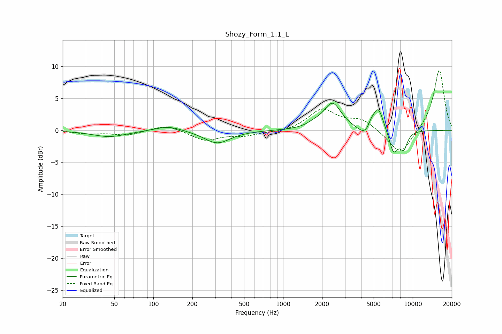

# Shozy_Form_1.1_L
See [usage instructions](https://github.com/jaakkopasanen/AutoEq#usage) for more options and info.

### Parametric EQs
Apply preamp of -4.3 dB when using parametric equalizer.

|   # | Type    |   Fc (Hz) |    Q |   Gain (dB) |
|-----|---------|-----------|------|-------------|
|   1 | Peaking |        46 | 1.09 |        -1   |
|   2 | Peaking |       131 | 1.43 |         0.8 |
|   3 | Peaking |       311 | 1.42 |        -2   |
|   4 | Peaking |      1731 | 2.62 |         0.5 |
|   5 | Peaking |      2404 | 2.1  |         4.2 |
|   6 | Peaking |      4309 | 2.75 |        -1.5 |
|   7 | Peaking |      4767 | 6    |         0.8 |
|   8 | Peaking |      5399 | 3.37 |         3.9 |
|   9 | Peaking |      7114 | 3.85 |        -3.5 |
|  10 | Peaking |      8503 | 4.43 |        -2.5 |

### Fixed Band EQs
When using fixed band (also called graphic) equalizer, apply preamp of **-9.5 dB** (if available) and set gains manually with these parameters.

|   # | Type    |   Fc (Hz) |    Q |   Gain (dB) |
|-----|---------|-----------|------|-------------|
|   1 | Peaking |        31 | 1.41 |        -0.5 |
|   2 | Peaking |        62 | 1.41 |        -0.7 |
|   3 | Peaking |       125 | 1.41 |         0.9 |
|   4 | Peaking |       250 | 1.41 |        -1.6 |
|   5 | Peaking |       500 | 1.41 |        -0.7 |
|   6 | Peaking |      1000 | 1.41 |        -0.3 |
|   7 | Peaking |      2000 | 1.41 |         3.2 |
|   8 | Peaking |      4000 | 1.41 |         1.6 |
|   9 | Peaking |      8000 | 1.41 |        -4   |
|  10 | Peaking |     16000 | 1.41 |         9.6 |

### Graphs

