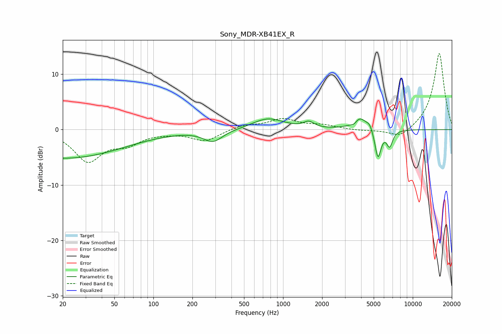

# Sony_MDR-XB41EX_R
See [usage instructions](https://github.com/jaakkopasanen/AutoEq#usage) for more options and info.

### Parametric EQs
Apply preamp of -2.0 dB when using parametric equalizer.

|   # | Type    |   Fc (Hz) |    Q |   Gain (dB) |
|-----|---------|-----------|------|-------------|
|   1 | Peaking |        20 | 0.3  |        -5.2 |
|   2 | Peaking |       288 | 1.94 |        -2.1 |
|   3 | Peaking |       765 | 1.17 |         2   |
|   4 | Peaking |      1578 | 3.6  |         1.1 |
|   5 | Peaking |      3535 | 6    |        -0.6 |
|   6 | Peaking |      3892 | 2.71 |         2.3 |
|   7 | Peaking |      4656 | 5.98 |         1   |
|   8 | Peaking |      4941 | 2.4  |         0   |
|   9 | Peaking |      5390 | 5.92 |        -5.3 |
|  10 | Peaking |      6635 | 5.86 |        -2.8 |

### Fixed Band EQs
When using fixed band (also called graphic) equalizer, apply preamp of **-13.8 dB** (if available) and set gains manually with these parameters.

|   # | Type    |   Fc (Hz) |    Q |   Gain (dB) |
|-----|---------|-----------|------|-------------|
|   1 | Peaking |        31 | 1.41 |        -5.5 |
|   2 | Peaking |        62 | 1.41 |        -2.2 |
|   3 | Peaking |       125 | 1.41 |        -0.3 |
|   4 | Peaking |       250 | 1.41 |        -2   |
|   5 | Peaking |       500 | 1.41 |         0.8 |
|   6 | Peaking |      1000 | 1.41 |         1.8 |
|   7 | Peaking |      2000 | 1.41 |         0.7 |
|   8 | Peaking |      4000 | 1.41 |        -0.2 |
|   9 | Peaking |      8000 | 1.41 |        -1.7 |
|  10 | Peaking |     16000 | 1.41 |        13.9 |

### Graphs

