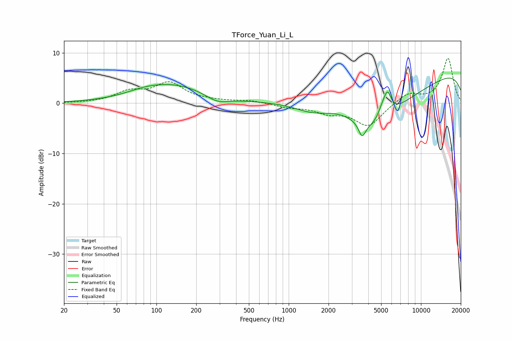

# TForce_Yuan_Li_L
See [usage instructions](https://github.com/jaakkopasanen/AutoEq#usage) for more options and info.

### Parametric EQs
Apply preamp of -5.1 dB when using parametric equalizer.

|   # | Type    |   Fc (Hz) |    Q |   Gain (dB) |
|-----|---------|-----------|------|-------------|
|   1 | Peaking |        81 | 1.16 |         0.6 |
|   2 | Peaking |       133 | 0.55 |         3.6 |
|   3 | Peaking |       289 | 1.6  |        -1.5 |
|   4 | Peaking |      1530 | 1.02 |        -2   |
|   5 | Peaking |      3589 | 5.4  |        -2.8 |
|   6 | Peaking |      4377 | 0.68 |        -9.3 |
|   7 | Peaking |      5122 | 3.78 |         2.2 |
|   8 | Peaking |      5594 | 4.82 |         4   |
|   9 | Peaking |      9464 | 0.41 |        -3.4 |
|  10 | Peaking |     10000 | 0.19 |         8.5 |

### Fixed Band EQs
When using fixed band (also called graphic) equalizer, apply preamp of **-9.0 dB** (if available) and set gains manually with these parameters.

|   # | Type    |   Fc (Hz) |    Q |   Gain (dB) |
|-----|---------|-----------|------|-------------|
|   1 | Peaking |        31 | 1.41 |         0   |
|   2 | Peaking |        62 | 1.41 |         2.1 |
|   3 | Peaking |       125 | 1.41 |         3.8 |
|   4 | Peaking |       250 | 1.41 |         0.3 |
|   5 | Peaking |       500 | 1.41 |         0.5 |
|   6 | Peaking |      1000 | 1.41 |        -0.7 |
|   7 | Peaking |      2000 | 1.41 |        -1.6 |
|   8 | Peaking |      4000 | 1.41 |        -4.5 |
|   9 | Peaking |      8000 | 1.41 |         2   |
|  10 | Peaking |     16000 | 1.41 |         8.9 |

### Graphs

