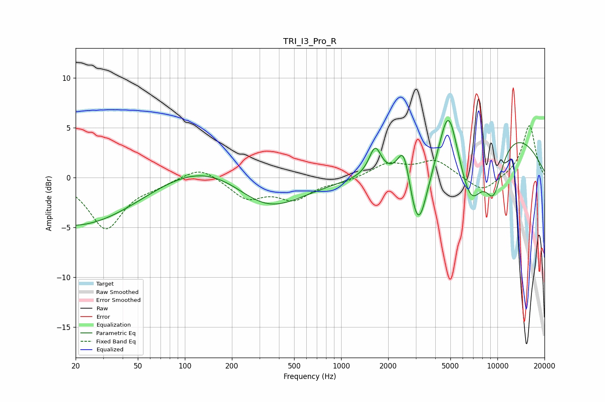

# TRI_I3_Pro_R
See [usage instructions](https://github.com/jaakkopasanen/AutoEq#usage) for more options and info.

### Parametric EQs
Apply preamp of -5.8 dB when using parametric equalizer.

|   # | Type    |   Fc (Hz) |    Q |   Gain (dB) |
|-----|---------|-----------|------|-------------|
|   1 | Peaking |        29 | 0.31 |        -8.3 |
|   2 | Peaking |        87 | 0.21 |         5.6 |
|   3 | Peaking |       328 | 0.58 |        -5.4 |
|   4 | Peaking |      1649 | 3.61 |         2.9 |
|   5 | Peaking |      2517 | 3.59 |         3.9 |
|   6 | Peaking |      3114 | 2.32 |        -7.2 |
|   7 | Peaking |      4859 | 2.43 |         6.2 |
|   8 | Peaking |      6745 | 1.63 |        -6.1 |
|   9 | Peaking |      9468 | 2.13 |        -5   |
|  10 | Peaking |     10000 | 0.34 |         5.1 |

### Fixed Band EQs
When using fixed band (also called graphic) equalizer, apply preamp of **-5.3 dB** (if available) and set gains manually with these parameters.

|   # | Type    |   Fc (Hz) |    Q |   Gain (dB) |
|-----|---------|-----------|------|-------------|
|   1 | Peaking |        31 | 1.41 |        -5.1 |
|   2 | Peaking |        62 | 1.41 |        -0.6 |
|   3 | Peaking |       125 | 1.41 |         1.3 |
|   4 | Peaking |       250 | 1.41 |        -2   |
|   5 | Peaking |       500 | 1.41 |        -2   |
|   6 | Peaking |      1000 | 1.41 |        -0.4 |
|   7 | Peaking |      2000 | 1.41 |         1.4 |
|   8 | Peaking |      4000 | 1.41 |         1.7 |
|   9 | Peaking |      8000 | 1.41 |        -1.6 |
|  10 | Peaking |     16000 | 1.41 |         5.3 |

### Graphs

