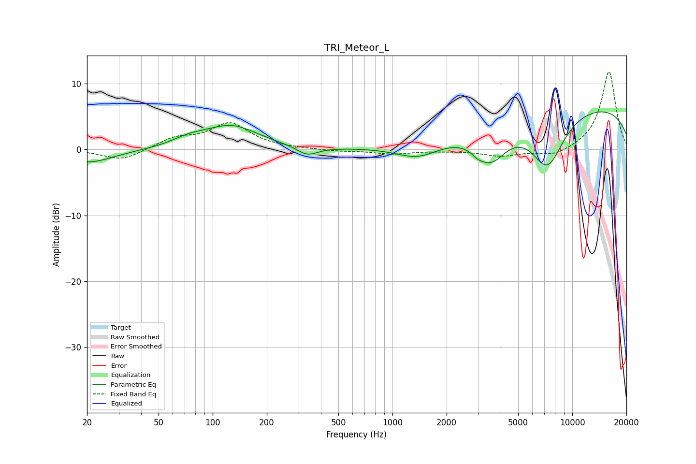

# TRI_Meteor_L
See [usage instructions](https://github.com/jaakkopasanen/AutoEq#usage) for more options and info.

### Parametric EQs
Apply preamp of -5.8 dB when using parametric equalizer.

|   # | Type    |   Fc (Hz) |    Q |   Gain (dB) |
|-----|---------|-----------|------|-------------|
|   1 | Peaking |        20 | 0.98 |        -2   |
|   2 | Peaking |        74 | 1.55 |         1   |
|   3 | Peaking |       127 | 0.94 |         3.5 |
|   4 | Peaking |       336 | 2.47 |        -1.4 |
|   5 | Peaking |      1395 | 1.11 |        -2.5 |
|   6 | Peaking |      2522 | 4.08 |         0.1 |
|   7 | Peaking |      2966 | 5.42 |        -0.4 |
|   8 | Peaking |      3491 | 1.47 |        -5.6 |
|   9 | Peaking |      7280 | 1.42 |        -8.3 |
|  10 | Peaking |      9813 | 0.18 |         6.9 |

### Fixed Band EQs
When using fixed band (also called graphic) equalizer, apply preamp of **-11.9 dB** (if available) and set gains manually with these parameters.

|   # | Type    |   Fc (Hz) |    Q |   Gain (dB) |
|-----|---------|-----------|------|-------------|
|   1 | Peaking |        31 | 1.41 |        -1.7 |
|   2 | Peaking |        62 | 1.41 |         1.6 |
|   3 | Peaking |       125 | 1.41 |         3.8 |
|   4 | Peaking |       250 | 1.41 |         0.1 |
|   5 | Peaking |       500 | 1.41 |        -0.3 |
|   6 | Peaking |      1000 | 1.41 |        -0.6 |
|   7 | Peaking |      2000 | 1.41 |        -0.1 |
|   8 | Peaking |      4000 | 1.41 |        -1   |
|   9 | Peaking |      8000 | 1.41 |        -1.1 |
|  10 | Peaking |     16000 | 1.41 |        11.9 |

### Graphs

