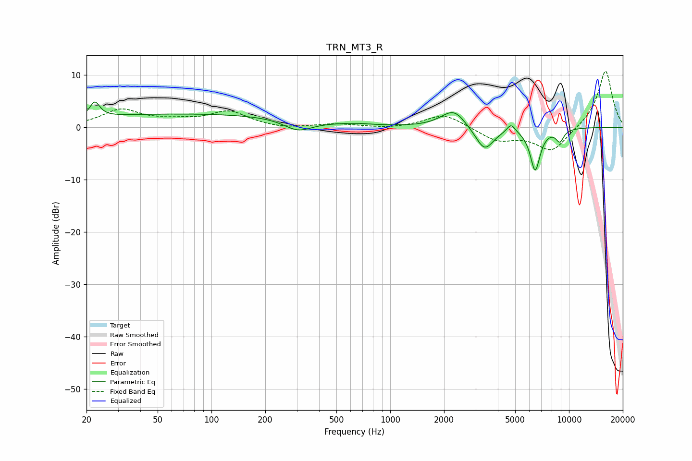

# TRN_MT3_R
See [usage instructions](https://github.com/jaakkopasanen/AutoEq#usage) for more options and info.

### Parametric EQs
Apply preamp of -4.9 dB when using parametric equalizer.

|   # | Type    |   Fc (Hz) |    Q |   Gain (dB) |
|-----|---------|-----------|------|-------------|
|   1 | Peaking |        22 | 5.34 |         2.9 |
|   2 | Peaking |        74 | 0.19 |         2.6 |
|   3 | Peaking |       306 | 1.77 |        -2.2 |
|   4 | Peaking |       648 | 1.97 |         0.2 |
|   5 | Peaking |      2046 | 1.94 |         0.7 |
|   6 | Peaking |      2294 | 2.31 |         2.8 |
|   7 | Peaking |      3371 | 2.77 |        -4.5 |
|   8 | Peaking |      4744 | 6    |         1.7 |
|   9 | Peaking |      6471 | 4.85 |        -8   |
|  10 | Peaking |      8891 | 5.75 |        -2.3 |

### Fixed Band EQs
When using fixed band (also called graphic) equalizer, apply preamp of **-10.8 dB** (if available) and set gains manually with these parameters.

|   # | Type    |   Fc (Hz) |    Q |   Gain (dB) |
|-----|---------|-----------|------|-------------|
|   1 | Peaking |        31 | 1.41 |         3.2 |
|   2 | Peaking |        62 | 1.41 |         1   |
|   3 | Peaking |       125 | 1.41 |         2.9 |
|   4 | Peaking |       250 | 1.41 |        -0.4 |
|   5 | Peaking |       500 | 1.41 |         0.6 |
|   6 | Peaking |      1000 | 1.41 |        -0.3 |
|   7 | Peaking |      2000 | 1.41 |         2.6 |
|   8 | Peaking |      4000 | 1.41 |        -2.5 |
|   9 | Peaking |      8000 | 1.41 |        -4.6 |
|  10 | Peaking |     16000 | 1.41 |        11   |

### Graphs

