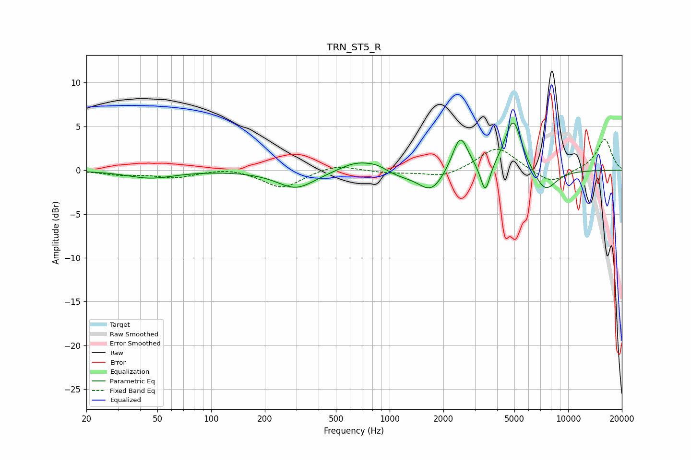

# TRN_ST5_R
See [usage instructions](https://github.com/jaakkopasanen/AutoEq#usage) for more options and info.

### Parametric EQs
Apply preamp of -5.5 dB when using parametric equalizer.

|   # | Type    |   Fc (Hz) |    Q |   Gain (dB) |
|-----|---------|-----------|------|-------------|
|   1 | Peaking |        46 | 1.08 |        -0.9 |
|   2 | Peaking |       299 | 1.33 |        -2   |
|   3 | Peaking |       649 | 1.46 |         1.2 |
|   4 | Peaking |       856 | 2.06 |         0.8 |
|   5 | Peaking |      1075 | 1.13 |        -0.8 |
|   6 | Peaking |      1713 | 2.04 |        -2.4 |
|   7 | Peaking |      2486 | 3.22 |         4.2 |
|   8 | Peaking |      3433 | 5.41 |        -3.4 |
|   9 | Peaking |      4924 | 2.87 |         6   |
|  10 | Peaking |      7416 | 2.1  |        -2.7 |

### Fixed Band EQs
When using fixed band (also called graphic) equalizer, apply preamp of **-3.6 dB** (if available) and set gains manually with these parameters.

|   # | Type    |   Fc (Hz) |    Q |   Gain (dB) |
|-----|---------|-----------|------|-------------|
|   1 | Peaking |        31 | 1.41 |        -0.5 |
|   2 | Peaking |        62 | 1.41 |        -0.8 |
|   3 | Peaking |       125 | 1.41 |         0.4 |
|   4 | Peaking |       250 | 1.41 |        -2.1 |
|   5 | Peaking |       500 | 1.41 |         0.7 |
|   6 | Peaking |      1000 | 1.41 |        -0.3 |
|   7 | Peaking |      2000 | 1.41 |        -0.8 |
|   8 | Peaking |      4000 | 1.41 |         2.7 |
|   9 | Peaking |      8000 | 1.41 |        -1.6 |
|  10 | Peaking |     16000 | 1.41 |         3.6 |

### Graphs

